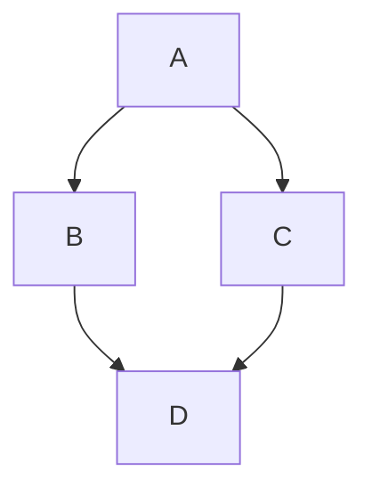



📚 文檔目錄

 -  -  -  -  - 





你可以通過右下角的 **簡** 按鈕切換為簡體顯示



---

## 配置文件速讀

你可以快速瞭解到所有配置的註解，讓你配置文件更加方便。
如果遇到不太清楚的配置，可以在這篇文章找到更加詳細的資訊。

```yaml
# --------------------------------------
# 導航設置
# --------------------------------------

nav:
  # 導航欄 Logo 圖片
  logo:
  # 是否顯示標題
  display_title: true
  # 是否在滾動時顯示文章標題
  display_post_title: true
  # 是否固定導航欄
  fixed: false

menu:
  # 首頁: / || fas fa-home
  # 列表||fas fa-list:
  #   音樂: /music/ || fas fa-music
  #   電影: /movies/ || fas fa-video

# --------------------------------------
# 代碼塊設置
# --------------------------------------

code_blocks:
  # 代碼塊主題: darker / pale night / light / ocean / false
  theme: light
  # 是否使用 Mac 風格
  macStyle: false
  # 代碼塊高度限制（單位: px）
  height_limit: false
  # 是否自動換行
  word_wrap: false

  # 工具欄
  # 是否顯示複製按鈕
  copy: true
  # 是否顯示語言標籤
  language: true
  # true: 收縮代碼塊 | false: 展開代碼塊 | none: 展開代碼塊並隱藏按鈕
  shrink: false
  # 是否顯示全屏顯示代碼塊按鈕
  fullpage: false

# 社交媒體鏈接
# 格式:
#   icon: 鏈接 || 描述 || 顏色
social:

# --------------------------------------
# 圖片設置
# --------------------------------------

# 網站的 favicon 圖標
favicon: /img/favicon.png

# 頭像設置
avatar:
  # 頭像圖片鏈接
  img: https://i.loli.net/2021/02/24/5O1day2nriDzjSu.png
  # 是否啟用頭像效果
  effect: false

# 禁用所有橫幅圖片
disable_top_img: false

# 如果頁面未設置橫幅，則顯示默認的橫幅圖片
default_top_img:

# 主頁的橫幅圖片
index_img:

# 歸檔頁的橫幅圖片
archive_img:

# 注意: 是標籤頁（單個標籤），不是標籤頁面（所有標籤）
tag_img:

# 標籤頁的橫幅圖片，可以為每個標籤設置橫幅圖片
# 格式:
#  - 標籤名: 圖片鏈接
tag_per_img:

# 注意: 是分類頁（單個分類），不是分類頁面（所有分類）
category_img:

# 分類頁的橫幅圖片，可以為每個分類設置橫幅圖片
# 格式:
#  - 分類名: 圖片鏈接
category_per_img:

# 頁腳的背景圖片
footer_img: false

# 網站背景
# 可以設置為顏色或圖片
# 圖片格式: url(http://xxxxxx.com/xxx.jpg)
background:

# 封面設置
cover:
  # 是否禁用封面
  index_enable: true
  aside_enable: true
  archives_enable: true
  # 主頁封面的位置
  # 選擇: left/right/both
  position: both
  # 當未設置封面時，顯示默認封面
  default_cover:
    # - https://i.loli.net/2020/05/01/gkihqEjXxJ5UZ1C.jpg

# 替換損壞的圖片
error_img:
  # 友鏈頁面的錯誤圖片
  flink: /img/friend_404.gif
  # 文章頁面的錯誤圖片
  post_page: /img/404.jpg

# 簡單的 404 頁面
error_404:
  # 是否啟用 404 頁面
  enable: false
  # 404 頁面的副標題
  subtitle: 'Page Not Found'
  # 404 頁面的卡片背景圖片
  background: https://i.loli.net/2020/05/19/aKOcLiyPl2JQdFD.png

# 文章元數據設置
post_meta:
  # 主頁頁面
  page:
    # 日期類型: created / updated / both
    date_type: created
    # 日期格式: date / relative
    date_format: date
    # 是否顯示分類
    categories: true
    # 是否顯示標籤
    tags: false
    # 是否顯示文字標籤
    label: true
  # 文章頁面
  post:
    # 元數據位置: left / center
    position: left
    # 日期類型: created / updated / both
    date_type: both
    # 日期格式: date / relative
    date_format: date
    # 是否顯示分類
    categories: true
    # 是否顯示標籤
    tags: true
    # 是否顯示文字標籤
    label: true

# --------------------------------------
# 首頁設置
# --------------------------------------

# 首頁頭圖的設置
# 默認: 頭圖全屏，站點信息在中間
# 站點信息的位置，例如: 300px/300em/300rem/10%
index_site_info_top:
# 頭圖的高度，例如: 300px/300em/300rem
index_top_img_height:

# 首頁的副標題設置
subtitle:
  # 是否啟用副標題
  enable: false
  # 是否啟用打字機效果
  effect: true
  # 自定義 typed.js
  # https://github.com/mattboldt/typed.js/#customization
  typed_option:
  # 來源 - 調用第三方服務 API（僅限中文）
  # 它將首先顯示來源，然後顯示副標題內容
  # 選擇: false/1/2/3
  # false - 禁用此功能
  # 1 - hitokoto.cn
  # 2 - yijuzhan.com
  # 3 - jinrishici.com
  source: false
  # 如果關閉打字機效果，副標題將僅顯示 sub 的第一行內容
  sub:

# 首頁文章佈局
# 1: 行佈局
# 2: 列布局
index_layout: 1

# 在首頁顯示文章簡介
# 1: 描述
# 2: 兩者（如果存在描述，將顯示描述，否則顯示自動摘要）
# 3: 自動摘要（默認）
# false: 不顯示文章簡介
index_post_content:
  method: 3
  # 如果設置 method 為 2 或 3，需要配置長度
  length: 500

# --------------------------------------
# 文章設置
# --------------------------------------

toc:
  # 是否在文章中顯示目錄
  post: true
  # 是否在頁面中顯示目錄
  page: false
  # 是否顯示目錄編號
  number: true
  # 是否默認展開目錄
  expand: false
  # 是否使用簡潔風格（僅適用於文章）
  style_simple: false
  # 是否顯示滾動百分比
  scroll_percent: true

post_copyright:
  # 是否啟用版權聲明
  enable: true
  # 是否進行文章 URL 解碼
  decode: false
  # 作者鏈接
  author_href:
  # 許可證類型
  license: CC BY-NC-SA 4.0
  # 許可證鏈接
  license_url: https://creativecommons.org/licenses/by-nc-sa/4.0/

# 贊助/打賞
reward:
  # 是否啟用打賞
  enable: false
  # 打賞案例文本
  text:
  QR_code:
    # - img: /img/wechat.jpg
    #   link:
    #   text: 微信
    # - img: /img/alipay.jpg
    #   link:
    #   text: 支付寶

# 文章編輯
# 輕鬆在線瀏覽和編輯博客源代碼
post_edit:
  # 是否啟用在線編輯
  enable: false
  # url: https://github.com/用戶名/倉庫名/edit/分支名/子目錄名/
  # 例如: https://github.com/jerryc127/butterfly.js.org/edit/main/source/
  url:

# 相關文章
related_post:
  # 是否顯示相關文章
  enable: true
  # 顯示的文章數量
  limit: 6
  # 選擇: created / updated
  date_type: created

# 選擇: 1 / 2 / false
# 1: “下一篇文章”將鏈接到舊文章
# 2: “下一篇文章”將鏈接到新文章
# false: 禁用分頁
post_pagination: 1

# 顯示文章過期通知
noticeOutdate:
  # 是否啟用過期通知
  enable: false
  # 樣式: simple / flat
  style: flat
  # 多少天后顯示通知
  limit_day: 365
  # 位置: top / bottom
  position: top
  message_prev: 已經過了
  message_next: 天自上次更新，文章內容可能已過時。

# --------------------------------------
# 頁腳設置
# --------------------------------------
footer:
  # 頁腳導航欄配置
  nav:
  owner:
    # 是否啟用所有者顯示
    enable: true
    # 網站創建年份
    since: 2019
  # 自定義文本
  custom_text:
  # 主題和框架的版權聲明
  copyright:
    enable: true
    # 顯示版本號
    version: true

# --------------------------------------
# 側邊欄設置
# --------------------------------------

aside:
  # 是否啟用側邊欄
  enable: true
  # 是否默認隱藏側邊欄
  hide: false
  # 是否在右下角顯示隱藏側邊欄的按鈕
  button: true
  # 移動設備上是否啟用側邊欄
  mobile: true
  # 側邊欄位置：left / right
  position: right
  display:
    # 歸檔頁面是否顯示側邊欄
    archive: true
    # 標籤頁面是否顯示側邊欄
    tag: true
    # 分類頁面是否顯示側邊欄
    category: true
  card_author:
    # 是否顯示作者信息卡片
    enable: true
    # 作者描述
    description:
    button:
      # 是否顯示按鈕
      enable: true
      # 按鈕圖標
      icon: fab fa-github
      # 按鈕文本
      text: Follow Me
      # 按鈕鏈接
      link: https://github.com/xxxxxx
  card_announcement:
    # 是否顯示公告卡片
    enable: true
    # 公告內容
    content: This is my Blog
  card_recent_post:
    # 是否顯示最近文章卡片
    enable: true
    # 顯示文章數量，0 表示顯示所有
    limit: 5
    # 排序方式：date / updated
    sort: date
    sort_order:
  card_newest_comments:
    # 是否顯示最新評論卡片
    enable: false
    sort_order:
    # 顯示評論數量
    limit: 6
    # 單位：分鐘，保存數據到 localStorage
    storage: 10
    # 是否顯示頭像
    avatar: true
  card_categories:
    # 是否顯示分類卡片
    enable: true
    # 顯示分類數量，0 表示顯示所有
    limit: 8
    # 選擇：none / true / false
    expand: none
    sort_order:
  card_tags:
    # 是否顯示標籤卡片
    enable: true
    # 顯示標籤數量，0 表示顯示所有
    limit: 40
    # 是否啟用顏色
    color: false
    # 標籤排序方式：random/name/length
    orderby: random
    # 排序順序：1 表示升序，-1 表示降序
    order: 1
    sort_order:
  card_archives:
    # 是否顯示歸檔卡片
    enable: true
    # 歸檔類型：monthly / yearly
    type: monthly
    # 日期格式，例如：YYYY年MM月
    format: MMMM YYYY
    # 排序順序：1 表示升序，-1 表示降序
    order: -1
    # 顯示歸檔數量，0 表示顯示所有
    limit: 8
    sort_order:
  card_post_series:
    # 是否顯示系列文章卡片
    enable: true
    # 標題顯示系列名稱
    series_title: false
    # 排序方式：title 或 date
    orderBy: 'date'
    # 排序順序：1 表示升序，-1 表示降序
    order: -1
  card_webinfo:
    # 是否顯示網站信息卡片
    enable: true
    # 是否顯示文章數量
    post_count: true
    # 是否顯示最後推送日期
    last_push_date: true
    sort_order:
    # 發佈日期與當前日期的時間差
    # 格式：Month/Day/Year Time 或 Year/Month/Day Time
    # 如果不啟用此功能，請留空
    runtime_date:

# --------------------------------------
# 右下角按鈕設置
# --------------------------------------

# 右下角按鈕與底部的距離（默認單位：px）
rightside_bottom:

# 簡繁轉換設置
translate:
  # 是否啟用簡繁轉換
  enable: false
  # 按鈕文本
  default: 繁
  # 網站語言（1 - 繁體中文 / 2 - 簡體中文）
  defaultEncoding: 2
  # 轉換延遲
  translateDelay: 0
  # 按鈕在簡體中文時的文本
  msgToTraditionalChinese: '繁'
  # 按鈕在繁體中文時的文本
  msgToSimplifiedChinese: '簡'

# 閲讀模式
readmode: true

# 暗黑模式設置
darkmode:
  # 是否啟用暗黑模式
  enable: true
  # 切換暗黑/明亮模式的按鈕
  button: true
  # 是否自動切換暗黑/明亮模式
  # autoChangeMode: 1  跟隨系統設置，如果系統不支持暗黑模式，則在晚上 6 點到早上 6 點之間切換暗黑模式
  # autoChangeMode: 2  在晚上 6 點到早上 6 點之間切換暗黑模式
  # autoChangeMode: false  不自動切換
  autoChangeMode: false
  # 設置明亮模式時間，值在 0 到 24 之間。如果未設置，默認值為 6 和 18
  start:
  end:

# 在返回頂部按鈕中顯示滾動百分比
rightside_scroll_percent: false

# 不要修改以下設置，除非你知道它們的工作原理
# 選擇：readmode,translate,darkmode,hideAside,toc,chat,comment
# 不要重複相同的值
rightside_item_order:
  # 是否啟用右側項目順序
  enable: false
  # 隱藏的默認項目：readmode,translate,darkmode,hideAside
  hide:
  # 顯示的默認項目：toc,chat,comment
  show:

# 右下角配置按鈕動畫效果
rightside_config_animation: true

# --------------------------------------
# 全局設置
# --------------------------------------

# 錨點設置
anchor:
  # 滾動時，URL 將根據標題 ID 更新
  auto_update: false
  # 點擊標題滾動並更新錨點
  click_to_scroll: false

# 圖片標題
photofigcaption: false

# 複製設置
copy:
  # 是否啟用複製功能
  enable: true
  # 在複製的內容後添加版權信息
  copyright:
    enable: false
    # 當複製字符數超過 limit_count 時添加版權信息
    limit_count: 150

# 需要安裝 hexo-wordcount 插件
wordcount:
  # 是否啟用字數統計
  enable: false
  # 在文章元信息中顯示字數統計
  post_wordcount: true
  # 在文章元信息中顯示閲讀時間
  min2read: true
  # 在側邊欄網站信息中顯示總字數
  total_wordcount: true

# 不蒜子 PV / UV 統計
busuanzi:
  # 網站 UV 統計
  site_uv: true
  # 網站 PV 統計
  site_pv: true
  # 頁面 PV 統計
  page_pv: true

# --------------------------------------
# 數學公式設置
# --------------------------------------

# 關於 per_page
# 如果設置為 true，將在每個頁面加載 mathjax/katex 腳本
# 如果設置為 false，將根據你的設置加載 mathjax/katex 腳本（在頁面的 front-matter 中添加 'mathjax: true' 或者 'katex: true'）
math:
  # 選擇：mathjax, katex
  # 如果不需要數學公式，保持為空
  use:
  per_page: true
  hide_scrollbar: false

  mathjax:
    # 啟用上下文菜單
    enableMenu: true
    # 選擇：all / ams / none，這控制是否對公式編號以及如何編號
    tags: none

  katex:
    # 啟用複製 KaTeX 公式
    copy_tex: false

# --------------------------------------
# 搜索設置
# --------------------------------------

search:
  # 選擇：algolia_search / local_search / docsearch
  # 如果不需要搜索功能，保持為空
  use:
  placeholder:

  # Algolia 搜索
  algolia_search:
    # 每頁搜索結果數量
    hitsPerPage: 6

  # 本地搜索
  local_search:
    # 頁面加載時預加載搜索數據
    preload: false
    # 每篇文章顯示的頂部 n 個搜索結果，設置為 -1 顯示所有結果
    top_n_per_article: 1
    # 將 HTML 字符串反轉義為可讀內容
    unescape: false
    CDN:

  # Docsearch
  # https://docsearch.algolia.com/
  docsearch:
    appId:
    apiKey:
    indexName:
    option:

# --------------------------------------
# 分享系統
# --------------------------------------

share:
  # 選擇：sharejs / addtoany
  # 如果不需要分享功能，保持為空
  use: sharejs

  # Share.js
  # https://github.com/overtrue/share.js
  sharejs:
    sites: facebook,twitter,wechat,weibo,qq

  # AddToAny
  # https://www.addtoany.com/
  addtoany:
    item: facebook,twitter,wechat,sina_weibo,facebook_messenger,email,copy_link

# --------------------------------------
# 評論系統
# --------------------------------------

comments:
  # 最多兩個評論系統，第一個將作為默認顯示
  # 如果不需要評論功能，保持為空
  # 選擇：Disqus/Disqusjs/Livere/Gitalk/Valine/Waline/Utterances/Facebook Comments/Twikoo/Giscus/Remark42/Artalk
  # 兩個評論系統的格式：Disqus,Waline
  use:
  # 按鈕旁邊顯示評論系統名稱
  text: true
  # 懶加載：評論系統將在評論元素進入瀏覽器視口時加載
  # 如果設置為 true，評論計數將無效
  lazyload: false
  # 在文章頂部圖片中顯示評論計數
  count: false
  # 在主頁顯示評論計數
  card_post_count: false

# Disqus 評論插件配置
# 官方文檔：https://disqus.com/
disqus:
  # Disqus 的 shortname
  shortname:
  # 最新評論小部件的 API 密鑰
  apikey:

# 使用 Disqus API 渲染評論的替代方案
# 官方文檔：https://github.com/SukkaW/DisqusJS
disqusjs:
  # Disqus 的 shortname
  shortname:
  # API 密鑰
  apikey:
  # 其他可選配置
  option:

# Livere 評論插件配置
# 官方文檔：https://www.livere.com/
livere:
  # Livere 的用戶 ID
  uid:

# Gitalk 評論插件配置
# 官方文檔：https://github.com/gitalk/gitalk
gitalk:
  # GitHub 應用的客戶端 ID
  client_id:
  # GitHub 應用的客戶端密鑰
  client_secret:
  # 存儲評論的倉庫名稱
  repo:
  # 倉庫擁有者的用戶名
  owner:
  # 管理員用戶名列表
  admin:
  # 其他可選配置
  option:

# Valine 評論插件配置
# 官方文檔：https://valine.js.org
valine:
  # LeanCloud 應用的 appId
  appId:
  # LeanCloud 應用的 appKey
  appKey:
  # 評論者頭像樣式
  avatar: monsterid
  # 該配置適用於國內自定義域名用戶，海外版本將自動檢測（無需手動填寫）
  serverURLs:
  # 評論框背景圖片
  bg:
  # 使用 Valine 的訪客計數作為頁面的訪客量
  visitor: false
  # 其他可選配置
  option:

# Waline 評論插件配置，一個簡單的評論系統，基於 Valine 開發，支持後端
# 官方文檔：https://waline.js.org/
waline:
  # 服務器 URL
  serverURL:
  # 評論框背景圖片
  bg:
  # 使用 Waline 的訪客計數作為頁面的訪客量
  pageview: false
  # 其他可選配置
  option:

# Utterances 評論插件配置
# 官方文檔：https://utteranc.es/
utterances:
  # 存儲評論的 GitHub 倉庫
  repo:
  # 問題映射方式，可選值：pathname/url/title/og:title
  issue_term: pathname
  # 淺色主題，可選值：github-light
  light_theme: github-light
  # 深色主題，可選值：photon-dark
  dark_theme: photon-dark

# Facebook 評論插件配置
# 官方文檔：https://developers.facebook.com/docs/plugins/comments/
facebook_comments:
  # 應用 ID
  app_id:
  # 用戶 ID，可選
  user_id:
  # 每頁顯示評論數
  pageSize: 10
  # 評論排序方式，可選值：social / time / reverse_time
  order_by: social
  # 語言設置
  lang: zh_TW

# Twikoo 評論插件配置
# 官方文檔：https://github.com/imaegoo/twikoo
twikoo:
  # 環境 ID
  envId:
  # 區域
  region:
  # 使用 Twikoo 的訪客計數作為頁面的訪客量
  visitor: false
  # 其他可選配置
  option:

# Giscus 評論插件配置
# 官方文檔：https://giscus.app/
giscus:
  # 倉庫地址
  repo:
  # 倉庫 ID
  repo_id:
  # 分類 ID
  category_id:
  # 主題配置，light 為淺色主題，dark 為深色主題
  theme:
    light: light
    dark: dark
  # 其他可選配置
  option:

# Remark42 評論插件配置
# 官方文檔：https://remark42.com/docs/configuration/frontend/
remark42:
  # 服務器地址
  host:
  # 站點 ID
  siteId:
  # 其他可選配置
  option:

# Artalk 評論插件配置
# 官方文檔：https://artalk.js.org/guide/frontend/config.html
artalk:
  # 服務器地址
  server:
  # 站點名
  site:
  # 使用 Artalk 的訪客計數作為頁面的訪客量
  visitor: false
  # 其他可選配置
  option:

# --------------------------------------
# 聊天服務配置
# --------------------------------------

chat:
  # 聊天服務類型，可選值：chatra/tidio/crisp，如果不需要聊天功能則留空
  use:
  # 推薦使用聊天按鈕，會在網站右下角創建一個按鈕，並隱藏原始按鈕
  rightside_button: false
  # 原始聊天按鈕在向上滾動時顯示，向下滾動時隱藏
  button_hide_show: false

# Chatra 聊天服務配置
# 官方網站：https://chatra.io/
chatra:
  # Chatra 服務 ID
  id:

# Tidio 聊天服務配置
# 官方網站：https://www.tidio.com/
tidio:
  # Tidio 公鑰
  public_key:

# Crisp 聊天服務配置
# 官方網站：https://crisp.chat/en/
crisp:
  # Crisp 網站 ID
  website_id:

# --------------------------------------
# 分析服務配置
# --------------------------------------

# 百度統計配置
# 官方網站：https://tongji.baidu.com/web/welcome/login
baidu_analytics:

# 谷歌分析配置
# 官方網站：https://analytics.google.com/analytics/web/
google_analytics:

# Cloudflare 分析配置
# 官方網站：https://www.cloudflare.com/zh-tw/web-analytics/
cloudflare_analytics:

# Microsoft Clarity 分析配置
# 官方網站：https://clarity.microsoft.com/
microsoft_clarity:

# https://umami.is/
umami_analytics:
  enable: false
  # 給自託管的 Umami 實例配置主機名
  serverURL:
  website_id:
  option:
  UV_PV:
    site_uv: false
    site_pv: false
    page_pv: false
    # Umami Cloud (API key) / self-hosted Umami (token)
    token:

# https://www.googletagmanager.com/
google_tag_manager:
  tag_id:
  # 可選配置
  domain:

# --------------------------------------
# 廣告配置
# --------------------------------------

# Google Adsense 廣告配置
google_adsense:
  # 是否啟用
  enable: false
  # 是否自動投放廣告
  auto_ads: true
  # 廣告腳本 URL
  js: https://pagead2.googlesyndication.com/pagead/js/adsbygoogle.js
  # 客戶 ID
  client:
  # 是否啟用頁面級廣告
  enable_page_level_ads: true

# 手動插入廣告配置，如果不需要廣告則留空
ad:
  # 在首頁每三個帖子後插入廣告
  index:
  # 在側邊欄插入廣告
  aside:
  # 在文章分頁前插入廣告
  post:

# --------------------------------------
# 站點驗證配置
# --------------------------------------

site_verification:
  # 示例：
  # - name: google-site-verification
  #   content: xxxxxx
  # - name: baidu-site-verification
  #   content: xxxxxxx

# --------------------------------------
# 美化 / 效果
# --------------------------------------

# 主題顏色自定義
# 注意：顏色值必須用雙引號，如 "#000"，否則可能會導致錯誤！

# 主題顏色配置
# theme_color:
#   是否啟用主題顏色
#   enable: true
#   主顏色
#   main: "#49B1F5"
#   分頁器顏色
#   paginator: "#00c4b6"
#   按鈕懸停顏色
#   button_hover: "#FF7242"
#   文本選擇顏色
#   text_selection: "#00c4b6"
#   鏈接顏色
#   link_color: "#99a9bf"
#   元數據顏色
#   meta_color: "#858585"
#   水平線顏色
#   hr_color: "#A4D8FA"
#   代碼前景色
#   code_foreground: "#F47466"
#   代碼背景色
#   code_background: "rgba(27, 31, 35, .05)"
#   目錄顏色
#   toc_color: "#00c4b6"
#   引用塊填充顏色
#   blockquote_padding_color: "#49b1f5"
#   引用塊背景顏色
#   blockquote_background_color: "#49b1f5"
#   滾動條顏色
#   scrollbar_color: "#49b1f5"
#   淺色模式下的主題顏色
#   meta_theme_color_light: "ffffff"
#   深色模式下的主題顏色
#   meta_theme_color_dark: "#0d0d0d"

# 分類和標籤頁面的用戶界面設置
# 選擇：index - 與主頁 UI 相同 / default - 與歸檔 UI 相同
# 留空或設置為 index
category_ui:
tag_ui:

# 拉伸行使每行寬度相等
text_align_justify: false

# 為頁眉和頁腳添加遮罩
mask:
  header: true
  footer: true

# 加載動畫
preloader:
  # 是否啟用加載動畫
  enable: false
  # 資源
  # 1. 全屏加載
  # 2. 進度條
  source: 1
  # pace 主題 (參見 https://codebyzach.github.io/pace/)
  pace_css_url:

# 頁面過渡效果
enter_transitions: true

# 默認顯示模式 - light (默認) / dark
display_mode: light

# 美化文章內容的配置
beautify:
  # 是否啟用美化
  enable: false
  # 指定美化的範圍 (site 或 post)
  field: post
  # 指定標題前綴圖標，如 '\f0c1'
  title-prefix-icon:
  # 指定標題前綴圖標的顏色，如 '#F47466'
  title-prefix-icon-color:

# 全局字體設置
# 除非您知道它們的工作原理，否則不要修改以下設置
font:
  global_font_size:
  code_font_size:
  font_family:
  code_font_family:

# 網站標題和副標題的字體設置
blog_title_font:
  font_link:
  font_family:

# 分隔符圖標的設置
hr_icon:
  # 是否啟用分隔符圖標
  enable: true
  # Font Awesome 圖標的 unicode 值，如 '\3423'
  icon:
  icon-top:

# 打字機效果
# https://github.com/disjukr/activate-power-mode
activate_power_mode:
  # 是否啟用打字機效果
  enable: false
  # 是否啟用彩色效果
  colorful: true
  # 是否啟用震動效果
  shake: true
  # 是否在移動設備上啟用
  mobile: false

# 背景效果
# --------------------------------------

# canvas_ribbon
# 參見: https://github.com/hustcc/ribbon.js
canvas_ribbon:
  # 是否啟用 canvas_ribbon
  enable: false
  # ribbon 的大小
  size: 150
  # ribbon 的不透明度 (0 ~ 1)
  alpha: 0.6
  zIndex: -1
  # 是否點擊更改顏色
  click_to_change: false
  # 是否在移動設備上啟用
  mobile: false

# Fluttering Ribbon
canvas_fluttering_ribbon:
  # 是否啟用 Fluttering Ribbon
  enable: false
  # 是否在移動設備上啟用
  mobile: false

# canvas_nest
# https://github.com/hustcc/canvas-nest.js
canvas_nest:
  # 是否啟用 canvas_nest
  enable: false
  # 線條顏色，默認: '0,0,0'; RGB 值: (R,G,B).(注意: 使用 ',' 分隔.)
  color: '0,0,255'
  # 線條的不透明度 (0~1)
  opacity: 0.7
  # 背景的 z-index 屬性
  zIndex: -1
  # 線條數量
  count: 99
  # 是否在移動設備上啟用
  mobile: false

# 鼠標點擊效果: 煙花
fireworks:
  # 是否啟用煙花效果
  enable: false
  zIndex: 9999
  # 是否在移動設備上啟用
  mobile: false

# 鼠標點擊效果: 心形符號
click_heart:
  # 是否啟用心形符號效果
  enable: false
  # 是否在移動設備上啟用
  mobile: false

# 鼠標點擊效果: 文字
clickShowText:
  # 是否啟用文字效果
  enable: false
  text:
    # - I
    # - LOVE
    # - YOU
  fontSize: 15px
  # 是否隨機顯示文字
  random: false
  # 是否在移動設備上啟用
  mobile: false

# --------------------------------------
# 燈箱設置
# --------------------------------------

# 選擇: fancybox / medium_zoom
# https://github.com/francoischalifour/medium-zoom
# https://fancyapps.com/fancybox/
# 如果不需要燈箱效果，請留空
lightbox:

# --------------------------------------
# 標籤外掛設置
# --------------------------------------

# 系列
series:
  # 是否啟用系列
  enable: false
  # 按標題或日期排序
  orderBy: 'title'
  # 排序方式。1, asc 為升序; -1, desc 為降序
  order: 1
  # 是否顯示編號
  number: true

# ABCJS - ABC 音樂符號插件
# https://github.com/paulrosen/abcjs
abcjs:
  # 是否啟用 ABCJS
  enable: false
  # 是否每頁啟用
  per_page: true

# Mermaid
# https://github.com/mermaid-js/mermaid
mermaid:
  # 是否啟用 Mermaid
  enable: false
  # 使用代碼塊編寫 Mermaid 圖表
  code_write: false
  # 內置主題: default / forest / dark / neutral
  theme:
    light: default
    dark: dark

# chartjs
# 參見 https://www.chartjs.org/docs/latest/
chartjs:
  enable: false
  # 除非你瞭解它們的工作原理，否則不要修改。
  # 默認設置僅在未指定 MD 語法時使用。
  # 圖表的字體顏色
  fontColor:
    light: "rgba(0, 0, 0, 0.8)"
    dark: "rgba(255, 255, 255, 0.8)"
  # 圖表的邊框顏色
  borderColor:
    light: "rgba(0, 0, 0, 0.1)"
    dark: "rgba(255, 255, 255, 0.2)"
  # 雷達圖和極區圖的刻度標籤背景顏色
  scale_ticks_backdropColor:
    light: "transparent"
    dark: "transparent"

# Note - Bootstrap 提示框
note:
  # Note 標籤樣式值:
  #  - simple    bs-callout 舊警告樣式。默認。
  #  - modern    bs-callout 新 (v2-v3) 警告樣式。
  #  - flat      扁平提示框樣式，帶背景，如 Mozilla 或 StackOverflow。
  #  - disabled  禁用所有 Note 標籤的 CSS 樣式。
  style: flat
  # 是否顯示圖標
  icons: true
  # 邊框半徑
  border_radius: 3
  # 背景顏色偏移百分比 (modern: -12 | 12; flat: -18 | 6)。
  # 也應用於標籤變量。此選項可與禁用的 Note 標籤一起使用。
  light_bg_offset: 0

# --------------------------------------
# 其他設置
# --------------------------------------

# https://github.com/MoOx/pjax
pjax:
  # 是否啟用 pjax
  enable: false
  # 排除指定頁面不使用 pjax，如 '/music/'
  exclude:
    # - /xxxxxx/

# 注入 CSS 和腳本 (aplayer/meting)
aplayerInject:
  # 是否啟用注入
  enable: false
  # 是否每頁啟用
  per_page: true

# Snackbar - Toast 通知
# https://github.com/polonel/SnackBar
# 位置: top-left / top-center / top-right / bottom-left / bottom-center / bottom-right
snackbar:
  # 是否啟用 Snackbar
  enable: false
  # 通知位置
  position: bottom-left
  # 淺色模式和深色模式下的通知背景顏色
  bg_light: '#49b1f5'
  bg_dark: '#1f1f1f'

# Instant.page
# https://instant.page/
instantpage: false

# Lazyload
# https://github.com/verlok/vanilla-lazyload
lazyload:
  # 是否啟用 Lazyload
  enable: false
  # 使用瀏覽器的原生 lazyload 而不是 vanilla-lazyload
  native: false
  # 指定使用 Lazyload 的範圍 (site 或 post)
  field: site
  placeholder:
  blur: false

# PWA
# 參見 https://github.com/JLHwung/hexo-offline
# ---------------
pwa:
  # 是否啟用 PWA
  enable: false
  # PWA manifest 文件路徑
  manifest:
  # Apple Touch 圖標路徑
  apple_touch_icon:
  # 32x32 像素的 favicon 圖標路徑
  favicon_32_32:
  # 16x16 像素的 favicon 圖標路徑
  favicon_16_16:
  # mask 圖標路徑
  mask_icon:

# Open graph meta tags
# 參見 https://hexo.io/docs/helpers#open-graph
Open_Graph_meta:
  # 是否啟用 Open Graph meta 標籤
  enable: true
  option:
    # twitter_card:
    # twitter_image:
    # twitter_id:
    # twitter_site:
    # google_plus:
    # fb_admins:
    # fb_app_id:

# 結構化數據
# https://developers.google.com/search/docs/guides/intro-structured-data
structured_data: true

# 添加供應商前綴以確保兼容性
# 是否啟用 CSS 前綴
css_prefix: true

# Inject
# 插入代碼到 head（在 '</head>' 標籤之前）和底部（在 '</body>' 標籤之前）
inject:
  head:
    # - <link rel="stylesheet" href="/xxx.css">
  bottom:
    # - <script src="xxxx"></script>

# CDN 設置
# 除非你知道它們的工作原理，否則不要修改以下設置
CDN:
  # 內部和第三方腳本的 CDN 提供商
  # 兩者的選項：local/jsdelivr/unpkg/cdnjs/custom
  # 注意： Dev 版本只能使用 'local' 作為內部腳本
  # 注意：將第三方腳本設置為 'local' 時，需要安裝 hexo-butterfly-extjs
  internal_provider: local
  third_party_provider: jsdelivr

  # 是否在 URL 中添加版本號，true 或 false
  version: false

  # 自定義格式
  # 例如：https://cdn.staticfile.org/${cdnjs_name}/${version}/${min_cdnjs_file}
  custom_format:

  option:
```

## 語言

修改 Hexo 的配置文件 `_config.yml`

默認語言是 `en`

主題支持

- default(en)
- zh-CN (簡體中文)
- zh-TW (臺灣繁體中文)
- zh-HK (香港繁體中文)
- ja (日語)
- ko (韓語)

## 網站資料

修改網站各種資料，例如標題、副標題和郵箱等個人資料，請修改 Hexo 的`_config.yml`


## 導航

### 參數設置

```yaml
nav:
  # Navigation bar logo image
  logo: /xxxx.png
  display_title: true
  display_post_title: true
  # Whether to fix navigation bar
  fixed: false
```

| 參數          | 解釋                                    |
| ------------- | --------------------------------------- |
| logo          | 網站的 logo，支持圖片，直接填入圖片鏈接 |
| display_title | 是否顯示網站標題，填寫 true 或者 false  |
| display_post_title | 是否在滾動時顯示文章標題，填寫 true 或者 false |
| fixed         | 是否固定狀態欄，填寫 true 或者 false    |

### 目錄

```yaml
Home: / || fas fa-home
Archives: /archives/ || fas fa-archive
Tags: /tags/ || fas fa-tags
Categories: /categories/ || fas fa-folder-open
List||fas fa-list:
  Music: /music/ || fas fa-music
  Movie: /movies/ || fas fa-video
Link: /link/ || fas fa-link
About: /about/ || fas fa-heart
```

必須是 `/xxx/`，後面`||`分開，然後寫圖標名。

如果不希望顯示圖標，圖標名可不寫。

默認子目錄是展開的，如果你想要隱藏，在子目錄裡添加 `hide` 。

```yaml
List||fas fa-list||hide:
  Music: /music/ || fas fa-music
  Movie: /movies/ || fas fa-video
```

**注意：** 導航的文字可自行更改

例如：

```markdown
menu:
首頁: / || fas fa-home
時間軸: /archives/ || fas fa-archive
標籤: /tags/ || fas fa-tags
分類: /categories/ || fas fa-folder-open
清單||fa fa-heartbeat:
音樂: /music/ || fas fa-music
照片: /Gallery/ || fas fa-images
電影: /movies/ || fas fa-video
友鏈: /link/ || fas fa-link
關於: /about/ || fas fa-heart
```


## 代碼塊



代碼塊中的所有功能只適用於 Hexo 自帶的代碼渲染

如果使用第三方的渲染器，不一定會有效



```yaml
code_blocks:
  # Code block theme: darker / pale night / light / ocean / false
  theme: light
  macStyle: false
  # Code block height limit (unit: px)
  height_limit: false
  word_wrap: false

  # Toolbar
  copy: true
  language: true
  # true: shrink the code blocks | false: expand the code blocks | none: expand code blocks and hide the button
  shrink: false
  fullpage: false
```

| 參數         | 解釋                                                              |
| ------------ | ----------------------------------------------------------------- |
| theme        | 代碼高亮主題，可選 darker / pale night / light / ocean / false    |
| macStyle     | 是否使用 Mac 風格                                                 |
| height_limit | 代碼塊高度限制（單位: px）, 可填寫 數字 或者 false                |
| word_wrap    | 是否自動換行                                                      |
| copy         | 是否顯示複製按鈕                                                  |
| language     | 是否顯示語言標籤                                                  |
| shrink       | true: 收縮代碼塊 / false: 展開代碼塊 / none: 展開代碼塊並隱藏按鈕 |
| fullpage     | 是否全屏顯示代碼塊                                                |

### 代碼高亮主題



<!-- tab 默認主題 -->

`Butterfly` 支持 6 種代碼高亮樣式：

- darker
- pale night
- light
- ocean

如果你需要 MacOS 風格的代碼高亮樣式，可以把`macStyle` 設為 `true`。


darker




pale night




light




ocean




macStyle



<!-- endtab -->

<!-- tab 自定義主題 -->

主題從 3.0 開始，支持使用自定義的代碼顔色。

如何自定義主題，請查看下面這篇文章。



<!-- endtab -->



### 代碼框展開/關閉

在默認情況下，代碼框自動展開，可設置是否所有代碼框都關閉狀態，點擊`>`可展開代碼

- true 全部代碼框不展開，需點擊`>`打開
- false 代碼框展開，有`>`點擊按鈕
- none 不顯示`>`按鈕

```yaml
highlight_shrink: true #代碼框不展開，需點擊 '>' 打開
```



你也可以在 post/page 頁對應的 markdown 文件 front-matter 添加 highlight_shrink 來獨立配置。

當**主題配置文件中**的 `highlight_shrink `設為 true 時，可在 front-matter 添加`highlight_shrink: false`來單獨配置文章展開代碼框。

當**主題配置文件中**的 `highlight_shrink `設為 false 時，可在 front-matter 添加`highlight_shrink: true`來單獨配置文章收縮代碼框。



`highlight_shrink: true`


`highlight_shrink: false`


`highlight_shrink: none`


### 代碼換行

在默認情況下，Hexo 在編譯的時候不會實現代碼自動換行。如果你不希望在代碼塊的區域裡有橫向滾動條的話，那麼你可以考慮開啟這個功能。

```yaml
code_word_wrap: true
```

如果你是使用 highlight 渲染，需要找到你站點的 Hexo 配置文件`_config.yml`，將`line_number`改成`false`:

```yaml
highlight:
  enable: true
  line_number: false # <- 改這裡
  auto_detect: false
  tab_replace:
```

如果你是使用 prismjs 渲染，需要找到你站點的 Hexo 配置文件`_config.yml`，將`line_number`改成`false`:

```yaml
prismjs:
  enable: false
  preprocess: true
  line_number: false # <- 改這裡
  tab_replace: ''
```


設置`code_word_wrap`之前




設置`code_word_wrap`之後



### 代碼高度限制


3.7.0 及以上支持


可配置代碼高度限制，超出的部分會隱藏，並顯示展開按鈕。

```yaml
highlight_height_limit: false # unit: px
```

注意：

1. 單位是 `px`，直接添加數字，如 200

2. 實際限制高度為 `highlight_height_limit + 30 px` ，多增加 30px 限制，目的是避免代碼高度只超出 highlight_height_limit 一點時，出現展開按鈕，展開沒內容。

3. 不適用於隱藏後的代碼塊（ css 設置 display: none）


## 社交圖標

Butterfly 支持 [font-awesome v6](https://fontawesome.com/icons?from=io) 圖標.

書寫格式 `圖標名：url || 描述性文字 || color`

```yaml
social:
  fab fa-github: https://github.com/xxxxx || Github || "#hdhfbb"
  fas fa-envelope: mailto:xxxxxx@gmail.com || Email || "#000000"
```

圖標名可在這尋找


PC:

!

Mobile:


## 圖片設置

### 頭像

```yaml
avatar:
  img: /img/avatar.png
  effect: true # 頭像會一直轉圈
```


### 頂部圖



如果不要顯示頂部圖，可直接配置 `disable_top_img: true`





頂部圖的獲取順序，如果都沒有配置，則不顯示頂部圖。

1. 頁面頂部圖的獲取順序：

   `各自配置的 top_img` > `配置文件的 default_top_img`

2. 文章頁頂部圖的獲取順序：

   `各自配置的 top_img` > `cover` > `配置文件的 default_top_img`



配置中的值：

| 配置             | 解釋                                                                |
| ---------------- | ------------------------------------------------------------------- |
| index_img        | 主頁的 top_img                                                      |
| default_top_img  | 默認的 top_img，當頁面的 top_img 沒有配置時，會顯示 default_top_img |
| archive_img      | 歸檔頁面的 top_img                                                  |
| tag_img          | tag 子頁面 的 默認 top_img                                          |
| tag_per_img      | tag 子頁面的 top_img，可配置每個 tag 的 top_img                     |
| category_img     | category 子頁面 的 默認 top_img                                     |
| category_per_img | category 子頁面的 top_img，可配置每個 category 的 top_img           |

其它頁面 （tags/categories/自建頁面）和 文章頁 的 `top_img` ，請到對應的 md 頁面設置`front-matter`中的`top_img`

以上所有的 top_img 可配置以下值

| 配置的值                                                                                                                                       | 效果                                                                                             |
| ---------------------------------------------------------------------------------------------------------------------------------------------- | ------------------------------------------------------------------------------------------------ |
| 留空                                                                                                                                           | 顯示默認的 top_img（如有），否則顯示默認的顔色<br>（文章頁 top_img 留空的話，會顯示 cover 的值） |
| img 鏈接                                                                                                                                       | 圖片的鏈接，顯示所配置的圖片                                                                     |
| 顔色(<br>HEX 值 - \#0000FF<br>RGB 值 - rgb(0,0,255)<br>顔色單詞 - orange<br>漸變色 - linear-gradient( 135deg, #E2B0FF 10%, #9F44D3 100%)<br>） | 對應的顔色                                                                                       |
| transparent                                                                                                                                    | 透明                                                                                             |
| false                                                                                                                                          | 不顯示 top_img                                                                                   |

`tag_per_img` 和 `category_per_img` 是 3.2.0 新增的內容，可對 tag 和 category 進行單獨的配置

並不推薦為每個 tag 和每個 category 都配置不同的頂部圖，因為配置太多會拖慢生成速度

```yaml
tag_per_img:
  aplayer: https://xxxxxx.png
  android: ddddddd.png

category_per_img：
  隨想: hdhdh.png
  推薦: ddjdjdjd.png
```


top_img: false




top_img: orange




top_img: 'linear-gradient(20deg, #0062be, #925696, #cc426e, #fb0347)'



### 頁腳背景圖

```yaml
# footer是否顯示圖片背景(與top_img一致)
footer_img: true
```

| 配置的值                                                                                                                                       | 效果                         |
| ---------------------------------------------------------------------------------------------------------------------------------------------- | ---------------------------- |
| 留空/false                                                                                                                                     | 顯示默認的顔色               |
| img 鏈接                                                                                                                                       | 圖片的鏈接，顯示所配置的圖片 |
| 顔色(<br>HEX 值 - \#0000FF<br>RGB 值 - rgb(0,0,255)<br>顔色單詞 - orange<br>漸變色 - linear-gradient( 135deg, #E2B0FF 10%, #9F44D3 100%)<br>） | 對應的顔色                   |
| transparent                                                                                                                                    | 透明                         |
| true                                                                                                                                           | 顯示跟 top_img 一樣          |


true



### 網站背景

默認顯示白色，可設置圖片或者顏色

```yaml
# 顏色（HEX值/RGB值/顔色單詞/漸變色)
# 留空 不顯示背景
background:
```

_留意:_ 如果你的網站根目錄不是'/',使用本地圖片時，需加上你的根目錄。
例如：網站是 `https://yoursite.com/blog`,引用一張`img/xx.png`圖片，則設置 background 為 `/blog/img/xx.png`


background:'#49B202'




background: https://i.loli.net/2019/09/09/5oDRkWVKctx2b6A.png



## 文章封面

文章的 markdown 文檔上,在 `Front-matter` 添加 `cover` ,並填上要顯示的圖片地址。

如果不配置 `cover`,可以設置顯示默認的 cover。

如果不想在首頁顯示 cover, 可以設置為 `false`。


文章封面的獲取順序 `Front-matter 的 cover` > `配置文件的 default_cover` > `false`


```yaml
cover:
  # 是否顯示文章封面
  index_enable: true
  aside_enable: true
  archives_enable: true
  default_cover:
```

| 參數            | 解釋                                                                                                                        |
| --------------- | --------------------------------------------------------------------------------------------------------------------------- |
| index_enable    | 主頁是否顯示文章封面圖                                                                                                      |
| aside_enable    | 側欄是否顯示文章封面圖                                                                                                      |
| archives_enable | 歸檔頁面是否顯示文章封面圖                                                                                                  |
| default_cover   | 默認的 cover, 可配置圖片鏈接/顔色/漸變色等                                                                                  |

當配置多張圖片時,會隨機選擇一張作為 cover.此時寫法應為

```yaml
default_cover:
  - https://jsd.012700.xyz/gh/jerryc127/CDN@latest/cover/default_bg.png
  - https://jsd.012700.xyz/gh/jerryc127/CDN@latest/cover/default_bg2.png
  - https://jsd.012700.xyz/gh/jerryc127/CDN@latest/cover/default_bg3.png
```


## 頁面 meta 顯示

這個選項是用來顯示文章的相關信息的。

```yaml
post_meta:
  # Home Page
  page:
    # Choose: created / updated / both
    date_type: created
    # Choose: date / relative
    date_format: date
    categories: true
    tags: false
    label: true
  post:
    # Choose: left / center
    position: left
    # Choose: created / updated / both
    date_type: both
    # Choose: date / relative
    date_format: date
    categories: true
    tags: true
    label: true
```

主頁：

| 參數        | 解釋                                                   |
| ----------- | ------------------------------------------------------ |
| date_type   | 顯示文章的時間，可選 created / updated / both          |
| date_format | 配置時間顯示明確時間還是相對時間，可選 date / relative |
| categories  | 是否顯示文章的分類                                     |
| tags        | 是否顯示文章的標籤                                     |
| label       | 是否顯示文字標簽                                       |

文章頁：

| 參數        | 解釋                                                   |
| ----------- | ------------------------------------------------------ |
| position    | 文章頁 meta 顯示的位置，可選 left / center             |
| date_type   | 顯示文章的時間，可選 created / updated / both          |
| date_format | 配置時間顯示明確時間還是相對時間，可選 date / relative |
| categories  | 是否顯示文章的分類                                     |
| tags        | 是否顯示文章的標籤                                     |
| label       | 是否顯示文字標簽                                       |


主頁




文章頁



`date_format` 是 3.2.0 新增的內容，配置時間顯示明確時間還是相對時間


相對時間




明確時間



## 首頁

### 首頁頂部圖大小

默認的顯示為全屏，網站信息會居中顯示

```yaml
# 主頁設置
# 默認top_img全屏，site_info在中間
# 使用默認, 都無需填寫（建議默認）
index_site_info_top: # 主頁標題距離頂部距離  例如 300px/300em/300rem/10%
index_top_img_height: #主頁top_img高度 例如 300px/300em/300rem  不能使用百分比
```

注意：`index_top_img_height`的值不能使用百分比。
2 個都不填的話，會使用默認值

舉例，當

```yaml
index_top_img_height: 400px
```

效果


### 網站副標題

可設置主頁中顯示的網站副標題或者喜歡的座右銘。

```yaml
# 主頁subtitle
subtitle:
  enable: false
  # Typewriter Effect (打字效果)
  effect: true
  # Customize typed.js
  # https://github.com/mattboldt/typed.js/#customization
  typed_option:
  # source 調用第三方服務
  # false 關閉調用
  # 1  調用一言網的一句話（簡體） https://hitokoto.cn/
  # 2  調用一句網（簡體） http://yijuzhan.com/
  # 3  調用今日詩詞（簡體） https://www.jinrishici.com/
  # subtitle 會先顯示 source , 再顯示 sub 的內容
  source: false
  # 如果關閉打字效果，subtitle 只會顯示 sub 的第一行文字
  sub:
    - 今日事&#44;今日畢
    - Never put off till tomorrow what you can do today
```


### 首頁卡片佈局

主題文章卡片支持 7 種佈局

```yaml
index_layout: 3
```

配置解釋：

| 配置值 | 解釋                                                                 |
| ------ | -------------------------------------------------------------------- |
| 1      | 封面在左，信息在右                                                   |
| 2      | 封面在右，信息在左                                                   |
| 3      | 封面和信息左右交替顯示                                               |
| 4      | 封面在上，信息在下                                                   |
| 5      | 信息顯示在封面上                                                     |
| 6      | 瀑布流佈局 - 封面在上，信息在下                                     |
| 7      | 瀑布流佈局 - 信息顯示在封面上                                       |

填寫`數字序號`即可，默認為 3


1: 封面在左，信息在右




2: 封面在右，信息在左




3: 封面和信息左右交替顯示




4: 封面在上，信息在下




5: 信息顯示在封面上




6: 瀑布流佈局 - 封面在上，信息在下




7: 瀑布流佈局 - 信息顯示在封面上



### 主頁文章節選

因為主題 UI 的關係，`主頁文章節選`只支持`自動節選`和`文章頁description`。

```yaml
# Display the article introduction on homepage
# 1: description
# 2: both (if the description exists, it will show description, or show the auto_excerpt)
# 3: auto_excerpt (default)
# false: do not show the article introduction
index_post_content:
  method: 3
  # If you set method to 2 or 3, the length need to config
  length: 500
```

| 參數    | 解釋                                                                 |
| ------- | -------------------------------------------------------------------- |
| method  | 顯示文章內容的方式，有四種可供選擇 <br> 1 - 只顯示 description <br> 2 - 優先選擇 description，如果沒有配置 description，則顯示自動節選的內容 <br> 3 - 只顯示自動節選 <br> 4 - 不顯示文章內容                              |
| length  | 自動節選的長度，只有在 method 為 2 或者 3 的時候才需要配置 length |

`description`在 front-matter 裡添加


## 文章頁

### TOC 目錄

在側邊欄顯示 TOC（文章目錄）

```yaml
toc:
  post: true
  page: false
  number: true
  expand: false
  # Only for post
  style_simple: false
  scroll_percent: true
```

| 屬性           | 解釋                                              |
| -------------- | ------------------------------------------------- |
| post           | 文章頁是否顯示 TOC                                |
| page           | 普通頁面是否顯示 TOC                              |
| number         | 是否顯示章節數                                    |
| expand         | 是否展開 TOC                                      |
| style_simple   | 簡潔模式（側邊欄**只**顯示 TOC, 只對文章頁有效 ） |
| scroll_percent | 是否顯示滾動進度百分比                            |


Toc PC




Toc Mobile




style_simple: true



#### 為特定的文章配置

在你的文章`md`文件的頭部，加入`toc_number`和`toc`，並配置`true`或者`false`即可。

主題會優先判斷文章 Markdown 的 Front-matter 是否有配置，如有，則以 Front-matter 的配置為準。否則，以**主題配置文件中**的配置為準。

### 文章版權

為你的博客文章展示文章版權和許可協議。

```yaml
post_copyright:
  # 是否啟用版權聲明
  enable: true
  # 是否進行文章 URL 解碼
  decode: false
  # 作者鏈接
  author_href:
  # 許可證類型
  license: CC BY-NC-SA 4.0
  # 許可證鏈接
  license_url: https://creativecommons.org/licenses/by-nc-sa/4.0/
```

由於`Hexo 4.1`開始，默認對網址進行解碼，以至於如果是中文網址，會被解碼，可設置`decode: true`來顯示中文網址。

如果有文章（例如：轉載文章）不需要顯示版權，可以在文章 Front-matter 單獨設置

```yaml
copyright: false
```

從`3.0.0`開始，支持對單獨文章設置版權信息，可以在文章 Front-matter 單獨設置

```markdown
copyright_author: xxxx
copyright_author_href: https://xxxxxx.com
copyright_url: https://xxxxxx.com
copyright_info: 此文章版權歸 xxxxx 所有，如有轉載，請註明來自原作者
```

**版權顯示截圖**


### 文章打賞/贊助

在你每篇文章的結尾，可以添加贊助按鈕。相關二維碼可以自行配置。

對於沒有提供二維碼的，可配置一張軟件的 icon 圖片，然後在 link 上添加相應的贊助鏈接。用戶點擊圖片就會跳轉到鏈接去。

link 可以不寫，會默認為圖片的鏈接。

```yaml
reward:
  enable: true
  text:
  QR_code:
    - img: /img/wechat.jpg
      link:
      text: 微信
    - img: /img/alipay.jpg
      link:
      text: 支付寶
```


### 文章編輯按鈕

在文章標題旁邊顯示一個編輯按鈕，點擊會跳轉到對應的鏈接去。

```yaml
# Post edit
# Easily browse and edit blog source code online.
post_edit:
  enable: false
  # url: https://github.com/user-name/repo-name/edit/branch-name/subdirectory-name/
  # For example: https://github.com/jerryc127/butterfly.js.org/edit/main/source/
  url:
```


### 相關文章


當文章封面設置為 false 時，或者沒有獲取到封面配置，相關文章背景將會顯示主題色。


相關文章推薦的原理是根據文章 tags 的比重來推薦

```yaml
related_post:
  enable: true
  limit: 6 # 顯示推薦文章數目
  date_type: created # or created or updated 文章日期顯示創建日或者更新日
```


### 文章分頁按鈕


當文章封面設置為 false 時，或者沒有獲取到封面配置，分頁背景將會顯示主題色。


可設置分頁的邏輯，也可以關閉分頁顯示

```yaml
# post_pagination (分頁)
# value: 1 || 2 || false
# 1: The 'next post' will link to old post
# 2: The 'next post' will link to new post
# false: disable pagination
post_pagination: false
```

| 參數                   | 解釋                 |
| ---------------------- | -------------------- |
| post_pagination: false | 關閉分頁按鈕         |
| post_pagination: 1     | 下一篇顯示的是舊文章 |
| post_pagination: 2     | 下一篇顯示的是新文章 |


### 文章過期提醒


如果你想單獨關閉某些文章的過期提醒，你可以在對應文章頁的 `front-matter` 中配置 `noticeOutdate: false` 來關閉。


可設置是否顯示文章過期提醒，以更新時間為基準。

```yaml
# Displays outdated notice for a post
noticeOutdate:
  enable: false
  # Style: simple / flat
  style: flat
  # When will it be shown
  limit_day: 365
  # Position: top / bottom
  position: top
  message_prev: It has been
  message_next: days since the last update, the content of the article may be outdated.
```

| 配置         | 解釋                          |
| ------------ | ----------------------------- |
| enable       | 是否開啟文章過期提醒          |
| style        | 提醒樣式, simple / flat       |
| limit_day    | 設置多少天後提醒，默認 365 天 |
| position     | 提醒位置 top / bottom         |
| message_prev | 提示文字                      |
| message_next | 提示文字                      |


style: flat




style: simple



## 頁腳

### 頁腳導航欄

頁腳導航欄可以配置為顯示在頁腳的頂部，或者不顯示。

> 你可以配置或者留空
> 留空則顯示舊版頁腳

以下是示例：

```yaml
  nav:
    - width:
      content:
        - title: 文檔
          item:
            - title: 🚀 快速開始
              url: /posts/21cfbf15/
            - title: 📑 主題頁面
              url: /posts/dc584b87/
            - title: 📌 主題配置
              url: /posts/4aa8abbe/
            - title: ⚔️ 標簽外掛
              url: /posts/ceeb73f/
            - title: ❓ 主題問答
              url: /posts/98d20436/
            - title: ⚡️ 進階教程
              url: /posts/4073eda/
    - content:
      - title: 其他
        item:
          - title: 圖庫
            url: /Gallery/
          - title: 留言板
            url: /messageboard/
          - title: 說說
            url: /talking/
          - title: 示例
            url: /link/
          - title: 友鏈
            url: /links/
    - content:
      - title: 框架
        item:
          - title: Hexo
            url: https://hexo.io/zh-cn/
          - title: Butterfly
            url: https://butterfly.js.org/
    - content:
      - title: 贊助
        item:
          - title: 支付寶
            url: https://jsd.012700.xyz/gh/jerryc127/CDN/Photo/alipay.jpg
            html: ""
```

配置解釋

| 配置       | 解釋                                                                 |
| ---------- | -------------------------------------------------------------------- |
| width      | 設置寬度，建議不配置（可不寫） |
| content    | 頁腳導航欄的內容，支持多個內容，每個內容可以有多個項目                                 |
| title      | 頁腳導航欄的標題                                                       |
| item       | 頁腳導航欄的項目，支持多個項目，每個項目可以有標題和鏈接                                 |
| title      | 頁腳導航欄項目的標題                                                   |
| url        | 頁腳導航欄項目的鏈接                                                   |
| html       | 頁腳導航欄項目的 HTML 內容，支持圖片等其他內容                                     |

### 博客年份

`since`是一個來展示你站點起始時間的選項。它位於頁面的最底部。

```yaml
footer:
  owner:
    enable: true
    since: 2018
```


### 頁腳自定義文本

`custom_text`是一個給你用來在頁腳自定義文本的選項。通常你可以在這裡寫聲明文本等,支持 HTML。

```yaml
custom_text: Hi, welcome to my <a href="https://butterfly.js.org/">blog</a>!
```


對於部分人需要寫 ICP 的，也可以寫在 `custom_text`裡

```yaml
custom_text: <a href="icp鏈接"><span>備案號：xxxxxx</span></a>
```

## Aside

### 配置

側邊欄的配置

```yaml
aside:
  enable: true
  hide: false
  # Show the button to hide the aside in bottom right button
  button: true
  mobile: true
  # Position: left / right
  position: right
  display:
    archive: true
    tag: true
    category: true
  card_author:
    enable: true
    description:
    button:
      enable: true
      icon: fab fa-github
      text: Follow Me
      link: https://github.com/xxxxxx
  card_announcement:
    enable: true
    content: This is my Blog
  card_recent_post:
    enable: true
    # If set 0 will show all
    limit: 5
    # Sort: date / updated
    sort: date
    sort_order:
  card_newest_comments:
    enable: false
    sort_order:
    limit: 6
    # Unit: mins, save data to localStorage
    storage: 10
    avatar: true
  card_categories:
    enable: true
    # If set 0 will show all
    limit: 8
    # Choose: none / true / false
    expand: none
    sort_order:
  card_tags:
    enable: true
    # If set 0 will show all
    limit: 40
    color: false
    # Order of tags, random/name/length
    orderby: random
    # Sort of order. 1, asc for ascending; -1, desc for descending
    order: 1
    sort_order:
  card_archives:
    enable: true
    # Type: monthly / yearly
    type: monthly
    # Eg: YYYY年MM月
    format: MMMM YYYY
    # Sort of order. 1, asc for ascending; -1, desc for descending
    order: -1
    # If set 0 will show all
    limit: 8
    sort_order:
  card_post_series:
    enable: true
    # The title shows the series name
    series_title: false
    # Order by title or date
    orderBy: 'date'
    # Sort of order. 1, asc for ascending; -1, desc for descending
    order: -1
  card_webinfo:
    enable: true
    post_count: true
    last_push_date: true
    sort_order:
    # Time difference between publish date and now
    # Formal: Month/Day/Year Time or Year/Month/Day Time
    # Leave it empty if you don't enable this feature
    runtime_date:
```


`sort_order` 是給每個卡片配置的排序，如果不配置，則按照主題配置文件的排序。數字越小，越靠前。


| 配置                          | 解釋                                                                                                   |
| ----------------------------- | ------------------------------------------------------------------------------------------------------ |
| enable                        | 是否啟用側邊欄                                                                                         |
| hide                          | 是否默認隱藏側邊欄                                                                                     |
| button                        | 是否顯示隱藏側邊欄的按鈕                                                                               |
| mobile                        | 是否在移動端顯示側邊欄                                                                                 |
| position                      | 側邊欄位置，left / right                                                                               |
| display.archive               | archive 頁面是否顯示 aside                                                                             |
| display.tag                   | tag 頁面是否顯示 aside                                                                                 |
| display.category              | category 頁面是否顯示 aside                                                                            |
| card_author.enable            | 是否顯示作者卡片                                                                                       |
| card_author.description       | 作者描述信息                                                                                           |
| card_author.button.enable     | 是否顯示按鈕                                                                                           |
| card_author.button.icon       | 按鈕圖標，可在這裡找到圖標名稱：https://fontawesome.com/icons?d=gallery&m=free                         |
| card_author.button.text       | 按鈕文字                                                                                               |
| card_author.button.link       | 按鈕鏈接                                                                                               |
| card_announcement.enable      | 是否顯示公告卡片                                                                                       |
| card_announcement.content     | 公告內容 （可使用 html 標簽）                                                                          |
| card_recent_post.enable       | 是否顯示最新文章卡片                                                                                   |
| card_recent_post.limit        | 顯示文章數目，0 為全部                                                                                 |
| card_recent_post.sort         | 排序方式，date / updated                                                                               |
| card_newest_comments.enable   | 是否顯示最新評論卡片                                                                                   |
| card_newest_comments.limit    | 顯示評論數目，0 為全部                                                                                 |
| card_newest_comments.storage  | 保存時間，單位分鐘，保存到本地存儲，避免每次刷新都重新請求數據                                         |
| card_newest_comments.avatar   | 是否顯示頭像                                                                                           |
| card_categories.enable        | 是否顯示分類卡片                                                                                       |
| card_categories.limit         | 顯示分類數目，0 為全部                                                                                 |
| card_categories.expand        | 是否展開分類，none / true / false                                                                      |
| card_tags.enable              | 是否顯示標籤卡片                                                                                       |
| card_tags.limit               | 顯示標籤數目，0 為全部                                                                                 |
| card_tags.color               | 是否顯示標籤顔色                                                                                       |
| card_tags.orderby             | 標籤排序方式，random / name / length                                                                   |
| card_tags.order               | 排序方式，1 為升序，-1 為降序                                                                          |
| card_archives.enable          | 是否顯示歸檔卡片                                                                                       |
| card_archives.type            | 歸檔類型，monthly / yearly                                                                             |
| card_archives.format          | 歸檔顯示格式，例如：YYYY 年 MM 月                                                                      |
| card_archives.order           | 排序方式，1 為升序，-1 為降序                                                                          |
| card_archives.limit           | 顯示歸檔數目，0 為全部                                                                                 |
| card_post_series.enable       | 是否顯示文章系列卡片                                                                                   |
| card_post_series.series_title | 是否顯示系列名稱                                                                                       |
| card_post_series.orderBy      | 排序方式，title / date                                                                                 |
| card_post_series.order        | 排序方式，1 為升序，-1 為降序                                                                          |
| card_webinfo.enable           | 是否顯示網站信息卡片                                                                                   |
| card_webinfo.post_count       | 是否顯示文章數量                                                                                       |
| card_webinfo.last_push_date   | 是否顯示最後更新日期                                                                                   |
| card_webinfo.runtime_date     | 顯示網站運行時間,不需要開啟，留空白就行（開啟格式一定要是 Month/Day/Year Time 或者 Year/Month/Day Time |



目前有三個評論 Livere、Facebook Comments 和 Giscus 不支持最新評論。

最新評論只會在刷新時才會去讀取，並不會實時變化

由於 API 有 訪問次數限制，為了避免調用太多，主題默認存取期限為 10 分鐘。也就是説，調用後資料會存在 _localStorage_ 裡，10 分鐘內刷新網站只會去 _localStorage_ 讀取資料。 10 分鐘期限一過，刷新頁面時才會去調取 API 讀取新的數據。（ 3.6.0 新增了 `storage` 配置，可自行配置緩存時間）




position: left




position: right




card_tags color: false




card_tags color: true




aside button




運行時間




最新評論



### 自定義添加欄目



## 右下角按鈕

### 按鈕位置

當開啟 chat 聊天服務後，聊天服務的按鈕可能會遮擋到右下角的按鈕，可以設置按鈕的位置。
非必要不建議設置，默認就行

```yaml
# The distance between the bottom right button and the bottom (default unit: px)
rightside_bottom:
```

默認單位為 px，直接添加數字即可。

### 簡繁轉換

主題內置了一個簡單的簡繁轉換功能，採用一對一的形式配對。遇到一字多繁或者一字多簡的情況下，會出現不能正常轉換正確的簡繁體，請留意。

開啟後，右下角會有簡繁轉換按鈕。

```yaml
translate:
  enable: true
  # 默認按鈕顯示文字(網站是簡體，應設置為'default: 繁')
  default: 簡
  #網站默認語言，1: 繁體中文, 2: 簡體中文
  defaultEncoding: 1
  #延遲時間,若不在前, 要設定延遲翻譯時間, 如100表示100ms,默認為0
  translateDelay: 0
  #當文字是簡體時，按鈕顯示的文字
  msgToTraditionalChinese: '繁'
  #當文字是繁體時，按鈕顯示的文字
  msgToSimplifiedChinese: '簡'
```

### 閲讀模式

閲讀模式下會去掉除文章外的內容，避免幹擾閲讀。

只會出現在文章頁面，右下角會有閲讀模式按鈕。

```yaml
readmode: true
```


### 夜間模式

右下角會有夜間模式按鈕

```yaml
# dark mode
darkmode:
  enable: true
  # dark mode和 light mode切換按鈕
  button: true
  autoChangeMode: false
  # Set the light mode time. The value is between 0 and 24. If not set, the default value is 6 and 18
  start: # 8
  end: # 22
```

| 參數           | 解釋                                                                                                                                                                                                                                                      |
| -------------- | --------------------------------------------------------------------------------------------------------------------------------------------------------------------------------------------------------------------------------------------------------- |
| button         | 是否在右下角顯示日夜模式切換按鈕                                                                                                                                                                                                                          |
| autoChangeMode | 自動切換的模式<br />autoChangeMode: 1 跟隨系統而變化，不支持的瀏覽器/系統將按照時間 start 到 end 之間切換為 light mode<br />autoChangeMode: 2 只按照時間 start 到 end 之間切換為 light mode ,其餘時間為 dark mode<br />autoChangeMode: false 取消自動切換 |
| start          | light mode 的開始時間                                                                                                                                                                                                                                     |
| end            | light mode 的結束時間                                                                                                                                                                                                                                     |


### 滾動狀態百分比

```yaml
# show scroll percent in scroll-to-top button
rightside_scroll_percent: true
```


### 按鈕排序

可對右下角按鈕進行排序

**注意：** 不要重複

```yaml
# Don't modify the following settings unless you know how they work (非必要請不要修改 )
# Choose: readmode,translate,darkmode,hideAside,toc,chat,comment
# Don't repeat 不要重複
rightside_item_order:
  enable: false
  hide: # readmode,translate,darkmode,hideAside
  show: # toc,chat,comment
```

## 全局配置

### 頁面錨點

開啟頁面錨點後，當你在進行滾動時，頁面鏈接會根據標題 ID 進行替換
(注意: 每替換一次，會留下一個歷史記錄。所以如果一篇文章有很多錨點的話，網頁的歷史記錄會很多。)

```yaml
# anchor
anchor:
  # when you scroll, the URL will update according to header id.
  auto_update: false
  # Click the headline to scroll and update the anchor
  click_to_scroll: false
```

| 配置            | 解釋                                               |
| --------------- | -------------------------------------------------- |
| auto_update     | 當滾動時，URL 將根據標題 id 更新。默認為 `false`。 |
| click_to_scroll | 點擊標題滾動並更新錨點。默認為 `false`。           |

### 圖片描述

可開啟圖片 Figcaption 描述文字顯示

優先顯示圖片的 title 屬性，然後是 alt 屬性

```yaml
photofigcaption: true
```


### 複製相關配置

可配置網站是否可以複製、複製的內容是否添加版權信息

```yaml
copy:
  enable: true
  # Add the copyright information after copied content
  copyright:
    enable: false
    limit_count: 150
```

| 配置        | 解釋                                                                   |
| ----------- | ---------------------------------------------------------------------- |
| enable      | 是否開啟網站複製權限                                                   |
| copyright   | 複製的內容後面加上版權信息                                             |
| enable      | 是否開啟複製版權信息添加                                               |
| limit_count | 字數限制，當複製文字大於這個字數限制時，將在複製的內容後面加上版權信息 |


添加版權信息後


```
Lorem ipsum dolor sit amet, test link consectetur adipiscing elit. Strong text pellentesque ligula commodo viverra vehicula. Italic text at ullamcorper enim. Morbi a euismod nibh. Underline text non elit nisl. Deleted text tristique, sem id condimentum tempus, metus lectus venenatis mauris, sit amet semper lorem felis a eros. Fusce egestas nibh at sagittis auctor. Sed ultricies ac arcu quis molestie. Donec dapibus nunc in nibh egestas, vitae volutpat sem iaculis. Curabitur sem tellus, elementum nec quam id, fermentum laoreet mi. Ut mollis ullamcorper turpis, vitae facilisis velit ultricies sit amet. Etiam laoreet dui odio, id tempus justo tincidunt id. Phasellus scelerisque nunc sed nunc ultricies accumsan.


作者: Jerry
連結: http://localhost:4000/posts/bd3c650b/#Paragraph
來源: Butterfly
著作權歸作者所有。商業轉載請聯絡作者獲得授權，非商業轉載請註明出處。
```

### 字數統計

開啟字數統計功能，需要安裝`hexo-wordcount`插件

在 hexo 工作目錄下運行 `npm install hexo-wordcount --save` or `yarn add hexo-wordcount`

```yaml
# Need to install the hexo-wordcount plugin
wordcount:
  enable: false
  # Display the word count of the article in post meta
  post_wordcount: true
  # Display the time to read the article in post meta
  min2read: true
  # Display the total word count of the website in aside's webinfo
  total_wordcount: true
```

| 參數            | 解釋                   |
| --------------- | ---------------------- |
| post_wordcount  | 在文章頁面顯示字數     |
| min2read        | 在文章頁面顯示閲讀時間 |
| total_wordcount | 在側邊欄顯示網站總字數 |


### 訪問人數 busuanzi (UV 和 PV)

訪問 busuanzi 的[官方網站](http://busuanzi.ibruce.info/)查看更多的介紹。

由於 busuanzi 的穩定性問題，偶爾會遇到無法訪問的情況，請留意。


文章頁的訪問人數統計，是通過 busuanzi 這個插件實現的。個別評論系統自帶訪問人數統計功能，可以在相對應的評論系統配置中進行開啟，其會代替 busuanzi 的統計。


```yaml
busuanzi:
  site_uv: true
  site_pv: true
  page_pv: true
```


如果需要修改 busuanzi 的 CDN 鏈接，可通過 `主題配置文件` 的 `CDN` 中的 `option` 進行修改


```yaml
CDN:
  option:
  	busuanzi: xxxxxxxxx
```


## Math 數學



<!-- tab 通用配置 -->

主題支持兩種數學公式渲染引擎，`MathJax` 和 `KaTeX`。你可以根據自己的需求選擇一種。

```yaml
# About the per_page
# if you set it to true, it will load mathjax/katex script in each page
# if you set it to false, it will load mathjax/katex script according to your setting (add the 'mathjax: true' or 'katex: true' in page's front-matter)
math:
  # Choose: mathjax, katex
  # Leave it empty if you don't need math
  use:
  per_page: true
  hide_scrollbar: false
```

| 參數           | 解釋                                                                                                                                                          |
| -------------- | ------------------------------------------------------------------------------------------------------------------------------------------------------------- |
| use            | 選擇數學公式渲染引擎，選擇 `mathjax` 或 `katex`，如果不需要數學公式，請留空                                                                                   |
| per_page       | 是否每一頁都加載數學公式渲染引擎，如果設置為 `false`，則需要在文章的 `Front-matter` 添加 `mathjax: true` 或 `katex: true`，對應的文章才會加載數學公式渲染引擎 |
| hide_scrollbar | 是否隱藏滾動條                                                                                                                                                |

<!-- endtab -->

<!-- tab MathJax -->


不要在標題裡使用 mathjax 語法，toc 目錄不一定能正確顯示 mathjax，可能顯示 mathjax 代碼



建議使用 KaTex 獲得更好的效果，下文有介紹！


開啟 Mathjax 需要把 `use` 設置為 `mathjax`

mathjax 配置文件

```yaml
mathjax:
  # Enable the contextual menu
  enableMenu: true
  # Choose: all / ams / none, This controls whether equations are numbered and how
  tags: none
```

| 參數       | 解釋                                                          |
| ---------- | ------------------------------------------------------------- |
| enableMenu | 啟用右鍵菜單                                                  |
| tags       | 選擇是否編號，`all` 全部編號，`ams` 只編號公式，`none` 不編號 |

使用 Mathjax 前，你需要卸載 hexo 的 markdown 渲染器，然後安裝[hexo-renderer-kramed](https://www.npmjs.com/package/hexo-renderer-kramed)

以下操作在你 hexo 博客的目錄下 (**不是 Butterfly 的目錄**):

1. 安裝插件

   ```bash
   npm uninstall hexo-renderer-marked --save
   npm install hexo-renderer-kramed --save
   ```

2. 配置 hexo 根目錄的配置文件

   ```yaml
   kramed:
     gfm: true
     pedantic: false
     sanitize: false
     tables: true
     breaks: true
     smartLists: true
     smartypants: true
   ```

效果：


<!-- endtab -->

<!-- tab KaTeX -->


不要在標題裡使用 KaTeX 語法，toc 目錄不能正確顯示 KaTeX。


開啟 KaTeX 需要把 `use` 設置為 `katex`

```yaml
katex:
  # Enable the copy KaTeX formula
  copy_tex: false
```

| 參數     | 解釋                    |
| -------- | ----------------------- |
| copy_tex | 啟用複製 KaTeX 公式功能 |

你不需要添加 `katex.min.js` 來渲染數學方程。相應的你需要卸載你之前的 hexo 的 markdown 渲染器，然後安裝其它插件。



<!-- tab hexo-renderer-markdown-it 【建議】 -->

卸載掉 marked 插件，安裝 [hexo-renderer-markdown-it](https://github.com/hexojs/hexo-renderer-markdown-it)

```bash
npm un hexo-renderer-marked --save # 如果有安裝這個的話，卸載
npm un hexo-renderer-kramed --save # 如果有安裝這個的話，卸載

npm i hexo-renderer-markdown-it --save # 需要安裝這個渲染插件
npm install katex @renbaoshuo/markdown-it-katex #需要安裝這個katex插件
```

在 hexo 的根目錄的 `_config.yml` 中配置

```yaml
markdown:
  plugins:
    - '@renbaoshuo/markdown-it-katex'
```

如需配置其它參數，請參考 [katex 官網](https://katex.org/docs/options.html)

<!-- endtab -->

<!-- tab hexo-renderer-markdown-it-plus -->


注意，此方法生成的 katex 沒有斜體


卸載掉 marked 插件，然後安裝新的`hexo-renderer-markdown-it-plus`:

```bash
# 替換 `hexo-renderer-kramed` 或者 `hexo-renderer-marked` 等hexo的markdown渲染器
# 你可以在你的package.json裡找到hexo的markdwon渲染器，並將其卸載
npm un hexo-renderer-marked --save

# or

npm un hexo-renderer-kramed --save


# 然後安裝 `hexo-renderer-markdown-it-plus`
npm i @upupming/hexo-renderer-markdown-it-plus --save
```

注意到 [`hexo-renderer-markdown-it-plus`](https://github.com/CHENXCHEN/hexo-renderer-markdown-it-plus)已經無人持續維護, 所以我們使用 [`@upupming/hexo-renderer-markdown-it-plus`](https://github.com/upupming/hexo-renderer-markdown-it-plus)。 這份 fork 的代碼使用了 [`@neilsustc/markdown-it-katex`](https://github.com/yzhang-gh/markdown-it-katex)同時它也是 VSCode 的插件 [Markdown All in One](https://github.com/yzhang-gh/vscode-markdown)所使用的, 所以我們可以獲得最新的 KaTex 功能例如 `\tag{}`。

你還可以通過 [`@neilsustc/markdown-it-katex`](https://github.com/yzhang-gh/markdown-it-katex)控制 KaTeX 的設置，所有可配置的選項參見 https://katex.org/docs/options.html。 比如你想要禁用掉 KaTeX 在命令行上輸出的宂長的警告信息，你可以在根目錄的 `_config.yml` 中使用下面的配置將 `strict` 設置為 false:

```yaml
markdown_it_plus:
  plugins:
    - plugin:
      name: '@neilsustc/markdown-it-katex'
      enable: true
      options:
        strict: false
```

當然，你還可以利用這個特性來定義一些自己常用的 `macros`。

<!-- endtab -->



因為 KaTeX 更快更輕量，因此沒有 MathJax 的功能多（比如右鍵菜單）。為那些使用 MathJax 的用戶，主題也內置了 katex 的 [複製](https://github.com/KaTeX/KaTeX/tree/master/contrib/copy-tex) 功能。


<!-- endtab -->



## 搜索



<!-- tab 通用配置 -->

主題支持三種搜索方式（algolia_search / local_search / docsearch），你可以選擇一種或者多種搜索方式。

```yaml
search:
  # Choose: algolia_search / local_search / docsearch
  # leave it empty if you don't need search
  use:
  placeholder:
```

| 參數        | 解釋                                   |
| ----------- | -------------------------------------- |
| use         | 選擇你需要的搜索方式，不需要開啟留空白 |
| placeholder | 搜索框的提示文字                       |

<!-- endtab -->

<!-- tab Algolia @fab fa-algolia -->


記得運行 hexo clean



如果你使用 [hexo-algoliasearch](https://github.com/LouisBarranqueiro/hexo-algoliasearch)，請記得配置 fields 參數的 `title`, `permalink` 和 `content`


1. 你需要安裝 [hexo-algolia](https://github.com/oncletom/hexo-algolia)或 [hexo-algoliasearch](https://github.com/LouisBarranqueiro/hexo-algoliasearch). 根據它們的説明文檔去做相應的配置。

2. 把主題配置文件中 search 的 use 配置為 `algolia_search`

其它配置

```yaml
# Algolia Search
algolia_search:
  # Number of search results per page
  hitsPerPage: 6
```

| 參數        | 解釋                   |
| ----------- | ---------------------- |
| hitsPerPage | 每頁顯示的搜索結果數量 |

3. 運行 Hexo

<!-- endtab -->

<!-- tab 本地搜索@fas fa-search -->


記得運行 hexo clean


1. 你需要安裝 [hexo-generator-searchdb](https://github.com/next-theme/hexo-generator-searchdb) 或者 [hexo-generator-search](https://github.com/PaicHyperionDev/hexo-generator-search)，根據它的文檔去做相應配置

2. 把主題配置文件中 search 的 use 配置為 `local_search`

其它配置

```yaml
# Local Search
local_search:
  # Preload the search data when the page loads.
  preload: false
  # Show top n results per article, show all results by setting to -1
  top_n_per_article: 1
  # Unescape html strings to the readable one.
  unescape: false
  CDN:
```

| 參數              | 解釋                                                                                       |
| ----------------- | ------------------------------------------------------------------------------------------ |
| preload           | 預加載，開啟後，進入網頁後會自動加載搜索文件。關閉時，只有點擊搜索按鈕後，才會加載搜索文件 |
| top_n_per_article | 匹配的文章結果，默認顯示最開始的 1 段結果                                                  |
| unescape          | 將 html 字符串解碼為可讀字符串                                                             |
| CDN               | 搜索文件的 CDN 地址（默認使用的本地鏈接）                                                  |

<!-- endtab -->

<!-- tab DocSearch @fas fa-search -->

DocSearch 是另一款由 algolia 提供的搜索服務，具體申請和使用請查看 [DocSearch 文檔](https://docsearch.algolia.com/)

1. 你需要申請 [DocSearch](https://docsearch.algolia.com/)，並獲取你的 `appId`, `apiKey`, `indexName`
2. 把主題配置文件中 search 的 use 配置為 `docsearch`

其它配置

```
  # Docsearch
  # https://docsearch.algolia.com/
  docsearch:
    appId:
    apiKey:
    indexName:
    option:
```

| 參數      | 解釋                                                                                           |
| --------- | ---------------------------------------------------------------------------------------------- |
| appId     | 【必須】你的 Algolia 應用 ID                                                                   |
| apiKey    | 【必須】你的 Algolia 搜索 API key                                                              |
| indexName | 【必須】你的 Algolia index name                                                                |
| option    | 【可選】其餘的 docsearch 配置<br />具體配置可查[這裡](https://docsearch.algolia.com/docs/api/) |


<!-- endtab -->



## 分享


只能選擇一個分享服務商




<!-- tab Sharejs -->

主題支持兩種分享方式，一種是`sharejs`，一種是`addtoany`。

```yaml
share:
  # Choose: sharejs / addtoany
  # Leave it empty if you don't need share
  use: sharejs
```

| 參數 | 解釋                                                          |
| ---- | ------------------------------------------------------------- |
| use  | 選擇分享方式，可選`sharejs`或`addtoany`，如果不需要分享請留空 |

<!-- endtab -->

<!-- tab Sharejs -->

如果你不知道 [sharejs](https://github.com/overtrue/share.js/)，看看它的説明。

```yaml
# Share.js
# https://github.com/overtrue/share.js
sharejs:
  sites: facebook,twitter,wechat,weibo,qq
```


<!-- endtab -->

<!-- tab Addtoany -->

可以到[addtoany](https://www.addtoany.com/)查看使用説明

```yaml
addtoany:
  item: facebook,twitter,wechat,sina_weibo,facebook_messenger,email,copy_link
```


<!-- endtab -->



## 評論



<!-- tab 通用設置 -->

主題支持多種評論系統，你可以根據自己的喜好選擇一種。
你也可以選擇雙評論，只需要配置兩個評論（第一個為默認顯示）

```yaml
comments:
  # Up to two comments system, the first will be shown as default
  # Leave it empty if you don't need comments
  # Choose: Disqus/Disqusjs/Livere/Gitalk/Valine/Waline/Utterances/Facebook Comments/Twikoo/Giscus/Remark42/Artalk
  # Format of two comments system : Disqus,Waline
  use:
  # Display the comment name next to the button
  text: true
  # Lazyload: The comment system will be load when comment element enters the browser's viewport.
  # If you set it to true, the comment count will be invalid
  lazyload: false
  # Display comment count in post's top_img
  count: false
  # Display comment count in Home Page
  card_post_count: false
```

| 參數            | 解釋                                                                                                                              |
| --------------- | --------------------------------------------------------------------------------------------------------------------------------- |
| use             | 使用的評論（請注意，最多支持兩個，如果不需要請留空）<br>_注意：雙評論不能是 Disqus 和 Disqusjs 一起，由於其共用同一個 ID，會出錯_ |
| text            | 是否顯示評論服務商的名字                                                                                                          |
| lazyload        | 是否為評論開啟 lazyload，開啟後，只有滾動到評論位置時才會加載評論所需要的資源（_開啟 lazyload 後，評論數將不顯示_）               |
| count           | 是否在文章頂部顯示評論數 <br/> livere、Giscus 和 utterances 不支持評論數顯示                                                      |
| card_post_count | 是否在首頁文章卡片顯示評論數<br/>gitalk、livere 、Giscus 和 utterances 不支持評論數顯示                                           |


單評論




雙評論



<!-- endtab -->

<!-- tab Disqus -->

註冊 [disqus](https://disqus.com/)，配置你自己的 disqus，然後在`Butterfly`裡開啟它。

```yaml
disqus:
  shortname:
```

| 參數      | 解釋                                                                     |
| --------- | ------------------------------------------------------------------------ |
| shortname | 你的 Disqus 短名稱，你可以在[這裡](https://disqus.com/admin/create/)創建 |


<!-- endtab -->

<!-- tab Disqusjs -->

與 Disqus 一樣，但由於 Disqus 在中國大陸無法訪問， 使用 Disqusjs 可以在無法訪問 Disqus 時顯示評論。具體可參考[Disqusjs](https://github.com/SukkaW/DisqusJS)。

```yaml
disqusjs:
  shortname:
  apikey:
  option:
```

| 參數      | 解釋                                                                          |
| --------- | ----------------------------------------------------------------------------- |
| shortname | 你的 Disqus 短名稱，你可以在[這裡](https://disqus.com/admin/create/)創建      |
| apikey    | 你的 Disqus API Key，你可以在[這裡](https://disqus.com/api/applications/)創建 |
| option    | 可選配置                                                                      |


當無法訪問 Disqus 時，會顯示



<!-- endtab -->

<!-- tab livere（來必力） -->

註冊[來必力](https://livere.com/)，配置你自己的來必力設置，然後在`Butterfly`裡開啟它。

```yaml
livere:
  uid:
```

| 參數 | 解釋                                                    |
| ---- | ------------------------------------------------------- |
| uid  | 你的來必力 uid，你可以在[這裡](https://livere.com/)創建 |

livere 的 uid 你能在這裡找到:


<!-- endtab -->

<!-- tab Gitalk -->

遵循 [gitalk](https://github.com/gitalk/gitalk)的指示去獲取你的 github Oauth 應用的 client id 和 secret 值。以及查看它的相關配置説明。

```yaml
gitalk:
  client_id:
  client_secret:
  repo:
  owner:
  admin:
  option:
```

| 參數          | 解釋                                                                  |
| ------------- | --------------------------------------------------------------------- |
| client_id     | GitHub 應用的 client ID                                               |
| client_secret | GitHub 應用的 client secret                                           |
| repo          | 存儲 issues 的 repo                                                   |
| owner         | 存儲 issues 的 repo 的擁有者                                          |
| admin         | GitHub repository 的所有者和合作者 (對這個 repository 有寫權限的用戶) |
| option        | 可選配置                                                              |


<!-- endtab -->

<!-- tab Valine -->

遵循 [Valine](https://github.com/xCss/Valine)的指示去配置你的 LeanCloud 應用。以及查看相應的配置説明。

```yaml
valine:
  appId:
  appKey:
  avatar: monsterid
  # This configuration is suitable for domestic custom domain name users, overseas version will be automatically detected (no need to manually fill in)
  serverURLs:
  bg:
  # Use Valine visitor count as the page view count
  visitor: false
  option:
```

| 參數       | 解釋                                                                                                   |
| ---------- | ------------------------------------------------------------------------------------------------------ |
| appId      | LeanCloud 應用的 appId                                                                                 |
| appKey     | LeanCloud 應用的 appKey                                                                                |
| avatar     | 頭像類型，可選值：`''`、`mp`、`identicon`、`monsterid`、`wavatar`、`retro`、`robohash`、`blank`、`404` |
| serverURLs | 自定義 LeanCloud 服務器地址，如果你使用國內自定義域名，請填寫此項，否則無需填寫                        |
| bg         | 背景圖片，可填寫圖片地址，如`https://example.com/bg.jpg`                                               |
| visitor    | 是否顯示文章閲讀數                                                                                     |
| option     | 可選配置                                                                                               |


開啟 visitor 後，文章頁的訪問人數將改為 Valine 提供，而不是 **不蒜子**


Valine 於 v1.4.5 開始支持自定義表情，如果你需要自行配置，請在`emojiCDN`配置表情 CDN。

同時在 Hexo 工作目錄下的`source/_data/`創建一個 json 文件`valine.json`,等同於 Valine 需要配置的`emojiMaps`，`valine.json`配置方式可參考如下


valine.json


```json
{
  "tv_doge": "6ea59c827c414b4a2955fe79e0f6fd3dcd515e24.png",
  "tv_親親": "a8111ad55953ef5e3be3327ef94eb4a39d535d06.png",
  "tv_偷笑": "bb690d4107620f1c15cff29509db529a73aee261.png",
  "tv_再見": "180129b8ea851044ce71caf55cc8ce44bd4a4fc8.png",
  "tv_冷漠": "b9cbc755c2b3ee43be07ca13de84e5b699a3f101.png",
  "tv_發怒": "34ba3cd204d5b05fec70ce08fa9fa0dd612409ff.png",
  "tv_發財": "34db290afd2963723c6eb3c4560667db7253a21a.png",
  "tv_可愛": "9e55fd9b500ac4b96613539f1ce2f9499e314ed9.png",
  "tv_吐血": "09dd16a7aa59b77baa1155d47484409624470c77.png",
  "tv_呆": "fe1179ebaa191569b0d31cecafe7a2cd1c951c9d.png",
  "tv_嘔吐": "9f996894a39e282ccf5e66856af49483f81870f3.png",
  "tv_困": "241ee304e44c0af029adceb294399391e4737ef2.png",
  "tv_壞笑": "1f0b87f731a671079842116e0991c91c2c88645a.png",
  "tv_大佬": "093c1e2c490161aca397afc45573c877cdead616.png",
  "tv_大哭": "23269aeb35f99daee28dda129676f6e9ea87934f.png",
  "tv_委屈": "d04dba7b5465779e9755d2ab6f0a897b9b33bb77.png",
  "tv_害羞": "a37683fb5642fa3ddfc7f4e5525fd13e42a2bdb1.png",
  "tv_尷尬": "7cfa62dafc59798a3d3fb262d421eeeff166cfa4.png",
  "tv_微笑": "70dc5c7b56f93eb61bddba11e28fb1d18fddcd4c.png",
  "tv_思考": "90cf159733e558137ed20aa04d09964436f618a1.png",
  "tv_驚嚇": "0d15c7e2ee58e935adc6a7193ee042388adc22af.png"
}
```



default_avatar


| 參數         | 效果                                                                              |
| ------------ | --------------------------------------------------------------------------------- |
| 留空（默認） |              |
| mp           |         |
| identicon    |  |
| monsterid    |  |
| wavatar      |    |
| retro        |      |
| robohash     |   |
| blank        |  |
| 404          |     |

<!-- endtab -->

<!-- tab Waline -->

Waline - 一款從 Valine 衍生的帶後端評論系統。可以將 Waline 等價成 With backend Valine。

具體配置可參考 [waline 文檔](https://waline.js.org/)

```yaml
waline:
  serverURL: # Waline server address url
  bg: # waline background
  pageview: false
  option:
```

| 參數      | 解釋                                                     |
| --------- | -------------------------------------------------------- |
| serverURL | Waline 服務器地址                                        |
| bg        | 背景圖片，可填寫圖片地址，如`https://example.com/bg.jpg` |
| pageview  | 是否顯示文章閲讀數                                       |
| option    | 可選配置                                                 |


開啟 pageview 後，文章頁的訪問人數將改為 Waline 提供，而不是 **不蒜子**



<!-- endtab -->

<!-- tab Utterances -->

與 Gitalk 一樣，基於 GitHub issues 的評論工具。相對於 Gitalk,其相對需要權限較少。具體配置可參考[Utterances](https://utteranc.es/)。

```yaml
utterances:
  repo:
  # 可選 pathname/url/title/og:title
  issue_term: pathname
  # 可選 github-light/github-dark/github-dark-orange/icy-dark/dark-blue/photon-dark
  light_theme: github-light
  dark_theme: photon-dark
```

| 參數        | 解釋                                                                                                          |
| ----------- | ------------------------------------------------------------------------------------------------------------- |
| repo        | GitHub repository 的全名，例如：`owner/repo`                                                                  |
| issue_term  | 用於識別問題的標籤，可以是 pathname/url/title/og:title                                                        |
| light_theme | 亮色主題，可選值：`github-light`、`github-dark`、`github-dark-orange`、`icy-dark`、`dark-blue`、`photon-dark` |
| dark_theme  | 暗色主題，可選值：`github-light`、`github-dark`、`github-dark-orange`、`icy-dark`、`dark-blue`、`photon-dark` |


<!-- endtab -->

<!-- tab Facebook Comments -->

`Facebook Comments`是 Facebook 提供的評論插件，需要登陸 Facebook 才可評論。

```yaml
# Facebook Comments Plugin
# https://developers.facebook.com/docs/plugins/comments/
facebook_comments:
  app_id:
  # optional
  user_id:
  pageSize: 10
  # Choose: social / time / reverse_time
  order_by: social
  lang: zh_TW
```

| 參數     | 解釋                                                                       |
| -------- | -------------------------------------------------------------------------- |
| app_id   | Facebook App ID，你可以在[這裡](https://developers.facebook.com/apps/)創建 |
| user_id  | Facebook User ID，可選，用於管理評論                                       |
| pageSize | 顯示的評論數                                                               |
| order_by | 評論排序方式,social/time/reverse_time                                      |
| lang     | 語言                                                                       |


<!-- endtab -->

<!-- tab Twikoo -->

`Twikoo` 是一個簡潔、安全、無後端的靜態網站評論系統，基於[騰訊雲開發](https://curl.qcloud.com/KnnJtUom)。

具體如何配置評論，請查看 [Twikoo 文檔](https://twikoo.js.org/quick-start.html#%E7%8E%AF%E5%A2%83%E5%88%9D%E5%A7%8B%E5%8C%96)

你只需要把獲取到的 `環境ID (envId)` 填寫到配置上去就行

```yaml
twikoo:
  envId:
  region:
  visitor: false
  option:
```

| 參數    | 解釋                                                               |
| ------- | ------------------------------------------------------------------ |
| envId   | 環境 ID                                                            |
| region  | 環境地域，默認為 ap-shanghai，如果您的環境地域不是上海，需傳此參數 |
| visitor | 是否顯示文章閲讀數                                                 |
| option  | 可選配置                                                           |


開啟 visitor 後，文章頁的訪問人數將改為 Twikoo 提供，而不是 **不蒜子**



<!-- endtab -->

<!-- tab Giscus -->

一個基於 _GitHub Discussions_ 的評論

```yaml
# Giscus
# https://giscus.app/
giscus:
  repo:
  repo_id:
  category_id:
  theme:
    light: light
    dark: dark
  option:
```

| 參數        | 解釋                                         |
| ----------- | -------------------------------------------- |
| repo        | GitHub repository 的全名，例如：`owner/repo` |
| repo_id     | GitHub repository 的 ID                      |
| category_id | GitHub repository 的分類 ID                  |
| option      | 可選配置                                     |

具體配置的意思，請參考 Giscus 的[文檔](https://giscus.app/zh-TW)


<!-- endtab -->

<!-- tab Remark42 -->

Remark42 是一款只支持**私有部署**的評論

具體部署請查看 [Installation | Remark42](https://remark42.com/docs/getting-started/installation/)

```yaml
remark42:
  host: # Your Host URL
  siteId: # Your Site ID
  option:
```

| 參數   | 解釋          |
| ------ | ------------- |
| host   | 你的 Host URL |
| siteId | 你的 Site ID  |
| option | 可選配置      |


<!-- endtab -->

<!-- tab Artalk -->

Artalk 是一款只支持**私有部署**的評論

具體部署請查看 [Artalk | 自託管評論系統](https://artalk.js.org/)

```yaml
artalk:
  server:
  site:
  # Use Artalk visitor count as the page view count
  visitor: false
  option:
```

| 參數    | 解釋               |
| ------- | ------------------ |
| server  | 你的 Server URL    |
| site    | 你的 Site ID       |
| visitor | 是否顯示文章閲讀數 |
| option  | 可選配置           |


開啟 visitor 後，文章頁的訪問人數將改為 Artalk 提供，而不是 **不蒜子**



<!-- endtab -->



## 在綫聊天



<!-- tab 通用設置 -->

主題內置了多種在綫聊天工具。你可以選擇開啟一種，方便你與訪客的交流。

```yaml
chat:
  # Choose: chatra/tidio/crisp
  # Leave it empty if you don't need chat
  use:
  # Chat Button [recommend]
  # It will create a button in the bottom right corner of website, and hide the origin button
  rightside_button: false
  # The origin chat button is displayed when scrolling up, and the button is hidden when scrolling down
  button_hide_show: false
```

| 參數             | 解釋                                                                          |
| ---------------- | ----------------------------------------------------------------------------- |
| use              | 選擇你要使用的聊天工具，可選擇`chatra`/`tidio`/`crisp` |
| rightside_button | 是否開啟右下角聊天按鈕                                                        |
| button_hide_show | 是否開啟滾動時隱藏聊天按鈕                                                    |

這些工具都提供了一個按鈕可以打開/關閉聊天窗口。
主題也提供了一個集合主題特色的按鈕來替換這些工具本身的按鈕，這個聊天按鈕將會出現在右下角裡。
你只需要把`rightside_button`打開就行。


為了不影響訪客的體驗，主題提供一個`button_hide_show`配置
設為`true`後，使用工具提供的按鈕時，只有向上滾動才會顯示聊天按鈕，向下滾動時會隱藏按鈕。

<!-- endtab -->

<!-- tab chatra -->


開啟 chatra， 把主題配置文件中 `chat` 的 `use`設置為`chatra`


配置 chatra,需要知道`Public key`

打開[chatra](https://chatra.com/)並註冊賬號。
你可以在`Preferences`中找到`Public key`


```yaml
# chatra
# https://chatra.io/
chatra:
  id: xxxxxxxx
```

`chatra`的樣式你可以`Chat Widget`自行配置



Demo



<!-- endtab -->

<!-- tab tidio -->


開啟 tidio， 把主題配置文件中 `chat` 的 `use`設置為`tidio`


配置 tidio,需要知道`Public key`

打開[tidio](https://www.tidio.com/)並註冊賬號。
你可以在`Preferences > Developer`中找到`Public key`


```yaml
# tidio
# https://www.tidio.com/
tidio:
  public_key: XXXX
```

`tidio`的樣式你可以`Channels`自行配置



Demo



<!-- endtab -->

<!-- tab crisp -->


開啟 crisp， 把主題配置文件中 `chat` 的 `use`設置為`crisp`


打開[crisp](https://crisp.chat/en/)並註冊帳號

找到需要的網站 ID

```yaml
# crisp
# https://crisp.chat/en/
crisp:
  website_id: xxxxxxxx
```


<!-- endtab -->



## 分析統計



<!-- tab 百度統計 -->

1. 登錄百度統計的[官方網站](https://tongji.baidu.com/web/welcome/login)

2. 找到你百度統計的統計代碼


3. 修改 `主題配置文件`

```yaml
baidu_analytics: 你的代碼
```

<!-- endtab -->

<!-- tab 谷歌分析 -->

1. 登錄谷歌分析的[官方網站](https://www.google.com/analytics/)

2. 找到你的谷歌分析的跟蹤 ID


3. 修改 `主題配置文件`

```yaml
google_analytics: 你的代碼 # 通常以`UA-`打頭
```

<!-- endtab -->

<!-- tab Cloudflare分析 -->

1. 登錄 Cloudflare 分析的[官方網站](https://www.cloudflare.com/zh-tw/web-analytics/)
2. 找到 `JavaScript 程式碼片段`
3. 找到你的 `token`


4. 修改 `主題配置文件`

   ```yaml
   # Cloudflare Analytics
   # https://www.cloudflare.com/zh-tw/web-analytics/
   cloudflare_analytics:
   ```

<!-- endtab -->

<!-- tab Microsoft Clarity -->

1. 登錄 Clarity 的[官方網站](https://clarity.microsoft.com/)

2. 創建 `PROJECT`

3. 找到你的 `ID`
  


4. 修改 `主題配置文件`

   ```yaml
   # Microsoft Clarity
   # https://clarity.microsoft.com/
   microsoft_clarity:
   ```

<!-- endtab -->



## 廣告



<!-- tab 谷歌廣告 -->

主題已集成谷歌廣告（自動廣告）

```yaml
google_adsense:
  enable: true
  auto_ads: true
  js: https://pagead2.googlesyndication.com/pagead/js/adsbygoogle.js
  client: # 填入個人識別碼
  enable_page_level_ads: true
```


<!-- endtab -->

<!-- tab 手動廣告配置 -->

主題預留了三個位置可供插入廣告，分別為主頁文章(每三篇文章出現廣告)/aside 公告之後/文章頁打賞之後。
把 html 代碼填寫到對應的位置

```yaml
ad:
  index:
  aside:
  post:
```

例如:

```yaml
index: <ins class="adsbygoogle" style="display:block" data-ad-format="fluid" data-ad-layout-key="xxxxxxxxxxxx" data-ad-client="ca-pub-xxxxxxxxxx" data-ad-slot="xxxxxxxxxx"></ins><script>(adsbygoogle=window.adsbygoogle||[]).push({})</script>
```


<!-- endtab -->



## 網站驗證

如果需要搜索引擎收錄網站，可能需要登錄對應搜索引擎的管理平臺進行提交。
各自的驗證碼可從各自管理平臺拿到

```yaml
site_verification:
  # - name: google-site-verification
  #   content: xxxxxx
  # - name: baidu-site-verification
  #   content: xxxxxxx
```

## 美化/特效

### 自定義主題色

可以修改大部分 UI 顏色

修改 `主題配置文件`，比如：


顏色值必須被雙引號包裹，就像`"#000"`而不是`#000`。否則將會在構建的時候報錯！


```yaml
theme_color:
  enable: true
  main: '#49B1F5'
  paginator: '#00c4b6'
  button_hover: '#FF7242'
  text_selection: '#00c4b6'
  link_color: '#99a9bf'
  meta_color: '#858585'
  hr_color: '#A4D8FA'
  code_foreground: '#F47466'
  code_background: 'rgba(27, 31, 35, .05)'
  toc_color: '#00c4b6'
  blockquote_padding_color: '#49b1f5'
  blockquote_background_color: '#49b1f5'
  scrollbar_color: '#49b1f5'
  meta_theme_color_light: 'ffffff'
  meta_theme_color_dark: '#0d0d0d'
```

| 參數                        | 解釋              |
| --------------------------- | ----------------- |
| main                        | 主題色            |
| paginator                   | 分頁器顏色        |
| button_hover                | 按鈕 hover 顏色   |
| text_selection              | 文字選中顏色      |
| link_color                  | 鏈接顏色          |
| meta_color                  | 文章元數據顏色    |
| hr_color                    | 分割線顏色        |
| code_foreground             | 代碼前景色        |
| code_background             | 代碼背景色        |
| toc_color                   | 目錄顏色          |
| blockquote_padding_color    | 引用邊框顏色      |
| blockquote_background_color | 引用背景色        |
| scrollbar_color             | 滾動條顏色        |
| meta_theme_color_light      | light mode 主題色 |
| meta_theme_color_dark       | dark mode 主題色  |


### 文字左右對齊

可設置文字向兩側對齊，對最後一行無效

```yaml
# Stretches the lines so that each line has equal width（文字向兩側對齊，對最後一行無效）
text_align_justify: true
```


text_align_justify: false




text_align_justify: true



### 黑色遮罩

為了避免圖片過於鮮艷而導致文字無法閲讀，默認為`頂部圖`和`頁腳`添加黑色遮罩

```yaml
# Add a mask to the header and footer
mask:
  header: true
  footer: true
```

### 頁面加載動畫 preloader

當進入網頁時，因為加載速度的問題，可能會導致 top_img 圖片出現斷層顯示，或者網頁加載不全而出現等待時間，開啟 preloader 後，會顯示加載動畫，等頁面加載完，加載動畫會消失。

主題支持 pace.js 的加載動畫，具體可查看 [pace.js](https://codebyzach.github.io/pace/)

配置 `butterly.yml`

```yaml
# 加載動畫 Loading Animation
preloader:
  enable: false
  # source
  # 1. fullpage-loading
  # 2. pace (progress bar)
  source: 1
  # pace theme (see https://codebyzach.github.io/pace/)
  pace_css_url:
```


fullpage-loading



### 頁面美化

會改變 ol、ul、h1-h5 的樣式

`field`配置生效的區域

- `post` 只在文章頁生效
- `site` 在全站生效

```yaml
# 美化頁面顯示
beautify:
  enable: true
  field: site # site/post
  title-prefix-icon: '\f0c1'
  title-prefix-icon-color: '#F47466'
```

| 參數                    | 解釋                   |
| ----------------------- | ---------------------- |
| enable                  | 是否開啟美化           |
| field                   | 美化的區域             |
| title-prefix-icon       | 標題前綴的 icon        |
| title-prefix-icon-color | 標題前綴的 icon 的顏色 |

`title-prefix-icon`填寫的是fontawesome的icon的Unicode數。



未開啟美化




開啟美化



### 自定義字體和字體大小

#### 全局字體

可自行設置字體的`font_family`

**如不需要配置，請留空**

```yaml
# Global font settings
# Don't modify the following settings unless you know how they work (非必要不要修改)
font:
  global_font_size:
  code_font_size:
  font_family: -apple-system, BlinkMacSystemFont, "Segoe UI", "Helvetica Neue", Lato, Roboto, "PingFang SC", "Microsoft JhengHei", "Microsoft YaHei", sans-serif
  code_font_family: consolas, Menlo, "PingFang SC", "Microsoft JhengHei", "Microsoft YaHei", sans-serif
```

| 參數             | 解釋         |
| ---------------- | ------------ |
| global_font_size | 全局字體大小 |
| code_font_size   | 代碼字體大小 |
| font_family      | 全局字體     |
| code_font_family | 代碼字體     |

#### Blog 標題字體

可自行設置字體的`font-family`
**如不需要配置，請留空。**
**如不需要使用網絡字體，只需要把 font_link 留空就行**

```yaml
# Font settings for the site title and site subtitle
# 左上角網站名字 主頁居中網站名字
blog_title_font:
  font_link: https://fonts.googleapis.com/css?family=Titillium+Web&display=swap
  font_family: Titillium Web, 'PingFang SC', 'Hiragino Sans GB', 'Microsoft JhengHei', 'Microsoft YaHei', sans-serif
```

| 參數        | 解釋           |
| ----------- | -------------- |
| font_link   | 網絡字體的連結 |
| font_family | 網站標題字體   |

### 打字效果

打字效果[activate-power-mode](https://github.com/disjukr/activate-power-mode)

```yaml
# Typewriter Effect (打字效果)
# https://github.com/disjukr/activate-power-mode
activate_power_mode:
  enable: true
  colorful: true # open particle animation (冒光特效)
  shake: true #  open shake (抖動特效)
  mobile: false
```

| 參數     | 解釋                     |
| -------- | ------------------------ |
| enable   | 是否開啟打字效果         |
| colorful | 是否開啟冒光特效         |
| shake    | 是否開啟抖動特效         |
| mobile   | 是否在移動端開啟打字效果 |


### 背景特效



<!-- tab 靜止綵帶 -->

好看的綵帶背景，可設置每次刷新更換綵帶，或者每次點擊更換綵帶

```yaml
canvas_ribbon:
  enable: false
  # The size of ribbon
  size: 150
  # The opacity of ribbon (0 ~ 1)
  alpha: 0.6
  zIndex: -1
  click_to_change: false
  mobile: false
```

| 參數            | 解釋               |
| --------------- | ------------------ |
| enable          | 是否開啟綵帶特效   |
| size            | 綵帶的大小         |
| alpha           | 綵帶的透明度       |
| zIndex          | 綵帶的層級         |
| click_to_change | 點擊更換綵帶       |
| mobile          | 手機端是否顯示綵帶 |

相關配置可查看[canvas_ribbon](https://github.com/hustcc/ribbon.js)


<!-- endtab -->

<!-- tab 動態綵帶 -->

好看的綵帶背景，會飄動

```yaml
canvas_fluttering_ribbon:
  enable: true
  mobile: false # false 手機端不顯示 true 手機端顯示
```


<!-- endtab -->

<!-- tab canvas-nest -->

```yaml
canvas_nest:
  enable: false
  # Color of lines, default: '0,0,0'; RGB values: (R,G,B).(note: use ',' to separate.)
  color: '0,0,255'
  # The opacity of line (0~1)
  opacity: 0.7
  # The z-index property of the background
  zIndex: -1
  # The number of lines
  count: 99
  mobile: false
```

| 參數    | 解釋               |
| ------- | ------------------ |
| enable  | 是否開啟綵帶特效   |
| color   | 綵帶的顏色         |
| opacity | 綵帶的透明度       |
| zIndex  | 綵帶的層級         |
| count   | 綵帶的條數         |
| mobile  | 手機端是否顯示綵帶 |


<!-- endtab -->



### 鼠標點擊效果



<!-- tab 煙花 @fas fa-fire-alt -->

```yaml
fireworks:
  enable: true
  zIndex: 9999 # -1 or 9999
  mobile: false
```

| 參數                      | 解釋                                   |
| ------------------------- | -------------------------------------- |
| enable                    | 是否開啟煙花特效                       |
| zIndex                    | 煙花的層級， `-1` 代表煙火效果在底部 / |
| `9999` 代表煙火效果在前面 |
| mobile                    | 手機端是否顯示煙花                     |


<!-- endtab -->

<!-- tab 愛心 @fas fa-heart -->

```yaml
# 點擊出現愛心
click_heart:
  enable: true
  mobile: false
```


<!-- endtab -->

<!-- tab 文字 @fab fa-amilia -->

```yaml
# 點擊出現文字，文字可自行修改
ClickShowText:
  enable: false
  text:
    - I
    - LOVE
    - YOU
  fontSize: 15px
  random: false # 文字隨機顯示
  mobile: false
```

| 參數     | 解釋               |
| -------- | ------------------ |
| enable   | 是否開啟文字特效   |
| text     | 文字內容           |
| fontSize | 文字大小           |
| random   | 文字隨機顯示       |
| mobile   | 手機端是否顯示文字 |


<!-- endtab -->



## 圖片大圖查看模式


如果你並不想為某張圖片添加大圖查看模式，你可以使用 html 格式引用圖片，併為圖片添加 `no-lightbox` class 名


```yaml
# Choose: fancybox / medium_zoom
# https://github.com/francoischalifour/medium-zoom
# https://fancyapps.com/fancybox/
# Leave it empty if you don't need lightbox
lightbox:
```

可配置 `fancybox` 或 `medium_zoom` 來啟用圖片大圖查看模式
不需要大圖查看模式時，請留空


FancyBox




Medium Zoom



## 標簽外掛

具體可查看 [標簽外掛](https://butterfly.js.org/posts/ceeb73f/)

## Mermaid

主題支持 Mermaid.js，可以在文章中使用 Mermaid.js 繪製流程圖、序列圖等。

配置：

```yaml
# Mermaid
# https://github.com/mermaid-js/mermaid
mermaid:
  enable: true
  # Write Mermaid diagrams using code blocks
  code_write: true
  # built-in themes: default / forest / dark / neutral
  theme:
    light: default
    dark: dark
```

### 書寫方法

主題支持兩種書寫方法

#### 標簽外掛

你可以使用標簽外掛的方式來使用 Mermaid.js
具體可查看 [Mermaid 標簽外掛](https://butterfly.js.org/posts/ceeb73f/#Mermaid)

#### 代碼塊書寫

你可以使用代碼塊的方式來使用 Mermaid.js

1. hexo 版本需要 7.0 或以上
2. hexo 的配置文件 要添加 `exclude_languages: ['mermaid']`

    ```yaml
    syntax_highlighter: 'highlight.js'
    highlight:
      line_number: true
      auto_detect: false
      tab_replace: ''
      wrap: true
      hljs: false
      exclude_languages: ['mermaid']
    prismjs:
      preprocess: true
      line_number: true
      tab_replace: ''
      exclude_languages: ['mermaid']
    ```

3. butterfly的配置文件中 mermaid 的 code_write 設為 true

> 例子




## Pjax

當用戶點擊鏈接，通過 ajax 更新頁面需要變化的部分，然後使用 HTML5 的 pushState 修改瀏覽器的 URL 地址。

這樣可以不用重複加載相同的資源（css/js）， 從而提升網頁的加載速度。

```yaml
pjax:
  enable: false
  # Exclude the specified pages from pjax, such as '/music/'
  exclude:
    # - /xxxxxx/
```



對於一些第三方插件，有些並不支持 pjax 。
你可以把**網頁**加入到 `exclude` 裡，這個網頁會被 pjax 排除在外。
點擊該網頁會重新加載網站

使用 pjax 後，一些自己 DIY 的 js 可能會無效，跳轉頁面時需要重新調用，請參考[Pjax 文檔](https://github.com/MoOx/pjax)
使用 pjax 後，一些個別頁面加載的 js/css，將會改為所有頁面都加載



## Snackbar 彈窗

Snackbar 彈窗,根據自己愛好開啟

```yaml
# Snackbar 彈窗
# https://github.com/polonel/SnackBar
# position 彈窗位置
# 可選 top-left / top-center / top-right / bottom-left / bottom-center / bottom-right
snackbar:
  enable: true
  position: bottom-left
  bg_light: '#49b1f5' #light mode時彈窗背景
  bg_dark: '#2d3035' #dark mode時彈窗背景
```


未開啟 Snackbar




開啟 Snackbar



## Instantpage

當鼠標懸停到鏈接上超過 65 毫秒時，Instantpage 會對該鏈接進行預加載，可以提升訪問速度。

修改配置文件

```yaml
# https://instant.page/
# prefetch (預加載)
instantpage: true
```

## PWA

要為`Butterfly`配上 PWA 特性, 你需要如下幾個步驟:

1. 打開 hexo 工作目錄

2. `npm install hexo-offline --save` 或者 `yarn add hexo-offline`

3. 在根目錄創建 `hexo-offline.config.cjs` 文件，並增加以下內容。

```js
// offline config passed to workbox-build.
module.exports = {
  globPatterns: ['**/*.{js,html,css,png,jpg,gif,svg,webp,eot,ttf,woff,woff2}'],
  // 靜態文件合集，如果你的站點使用了例如 webp 格式的文件，請將文件類型添加進去。
  globDirectory: 'public',
  swDest: 'public/service-worker.js',
  maximumFileSizeToCacheInBytes: 10485760, // 緩存的最大文件大小，以字節為單位。
  skipWaiting: true,
  clientsClaim: true,
  runtimeCaching: [
    // 如果你需要加載 CDN 資源，請配置該選項，如果沒有，可以不配置。
    // CDNs - should be CacheFirst, since they should be used specific versions so should not change
    {
      urlPattern: /^https:\/\/cdn\.example\.com\/.*/, // 可替換成你的 URL
      handler: 'CacheFirst'
    }
  ]
}
```

更多內容請查看 [hexo-offline](https://github.com/JLHwung/hexo-offline)的官方文檔

4. 在`主題配置文件`中開啟 pwa 選項。

```yaml
pwa:
  enable: true
  manifest: /img/pwa/manifest.json
  apple_touch_icon: /img/pwa/apple-touch-icon.png
  favicon_32_32: /img/pwa/32.png
  favicon_16_16: /img/pwa/16.png
  mask_icon: /img/pwa/safari-pinned-tab.svg
```

5. 在創建`source/`目錄中創建`manifest.json`文件。

```json
{
  "name": "string",
  "short_name": "Junzhou",
  "theme_color": "#49b1f5",
  "background_color": "#49b1f5",
  "display": "standalone",
  "scope": "/",
  "start_url": "/",
  "icons": [
    {
      "src": "images/pwaicons/36.png",
      "sizes": "36x36",
      "type": "image/png"
    },
    {
      "src": "images/pwaicons/48.png",
      "sizes": "48x48",
      "type": "image/png"
    },
    {
      "src": "images/pwaicons/72.png",
      "sizes": "72x72",
      "type": "image/png"
    },
    {
      "src": "images/pwaicons/96.png",
      "sizes": "96x96",
      "type": "image/png"
    },
    {
      "src": "images/pwaicons/144.png",
      "sizes": "144x144",
      "type": "image/png"
    },
    {
      "src": "images/pwaicons/192.png",
      "sizes": "192x192",
      "type": "image/png"
    },
    {
      "src": "images/pwaicons/512.png",
      "sizes": "512x512",
      "type": "image/png"
    }
  ],
  "splash_pages": null
}
```

你也可以通過 [Web App Manifest](https://app-manifest.firebaseapp.com/)快速創建`manifest.json`。（Web App Manifest 要求至少包含一個 512\*512 像素的圖標）

6. 可以通過`Chrome`插件`Lighthouse`檢查 PWA 配置是否生效以及配置是否正確。

   - 打開博客頁面
   - 啟動`Lighthouse`插件 (`Lighthouse`插件要求至少包含一個 512\*512 像素的圖標)

關於 PWA（漸進式增強 Web 應用）的更多內容請參閲 [Google Tools for Web Developers](https://developers.google.com/web/tools/lighthouse/audits/address-bar)

## Open Graph

在 `head` 裡增加一些 meta 資料，例如縮略圖、標題、時間等等。當你分享網頁到一些平臺時，平臺會讀取 Open Graph 的內容，展示縮略圖，標題等等信息。

修改配置文件

```yaml
# Open graph meta tags
# https://hexo.io/docs/helpers#open-graph
Open_Graph_meta:
  enable: true
  option:
    # twitter_card:
    # twitter_image:
    # twitter_id:
    # twitter_site:
    # google_plus:
    # fb_admins:
    # fb_app_id:
```

## CSS 前綴

有些 CSS 並不是所有瀏覽器都支持，需要增加對應的前綴才會生效。

開啟 `css_prefix` 後，會自動為一些 CSS 增加前綴。（會增加 20%的體積）

修改配置文件

```yaml
# Add the vendor prefixes to ensure compatibility
css_prefix: true
```

## Inject


2.3.0 以上支持


如想添加額外的 js/css/meta 等等東西，可以在 Inject 裡添加，支持添加到 head(`</body>`標籤之前)和 bottom(`</html>`標籤之前)。

請注意：以標準的 html 格式添加內容

例如

```yaml
inject:
  head:
  	- <link rel="stylesheet" href="/self.css">
  bottom:
  	- <script src="xxxx"></script>
```

_留意:_ 如果你的網站根目錄不是'/',使用本地圖片時，需加上你的根目錄。
例如：網站是 `https://yoursite.com/blog`,引用`css/xx.css`，則設置為`<link rel="stylesheet" href="/blog/css/xx.css">`

## CDN

配置文件中最後一部分 CDN，裡面是主題所引用到的文件，可自行配置 CDN。（非必要請勿修改，配置後請確認鏈接是否能訪問）

```yaml
# CDN Settings
# Don't modify the following settings unless you know how they work
CDN:
  # The CDN provider for internal and third-party scripts
  # Options for both: local/jsdelivr/unpkg/cdnjs/custom
  # Note: Dev version can only use 'local' for internal scripts
  # Note: When setting third-party scripts to 'local', you need to install hexo-butterfly-extjs
  internal_provider: local
  third_party_provider: jsdelivr

  # Add version number to url, true or false
  version: false

  # Custom format
  # For example: https://cdn.staticfile.org/${cdnjs_name}/${version}/${min_cdnjs_file}
  custom_format:

  option:
    # abcjs_basic_js:
    # activate_power_mode:
    # algolia_js:
    # algolia_search:
    # aplayer_css:
    # aplayer_js:
    # artalk_css:
    # artalk_js:
    # blueimp_md5:
    # busuanzi:
    # canvas_fluttering_ribbon:
    # canvas_nest:
    # canvas_ribbon:
    # click_heart:
    # clickShowText:
    # disqusjs:
    # disqusjs_css:
    # docsearch_css:
    # docsearch_js:
    # egjs_infinitegrid:
    # fancybox:
    # fancybox_css:
    # fireworks:
    # fontawesome:
    # gitalk:
    # gitalk_css:
    # giscus:
    # instantpage:
    # instantsearch:
    # katex:
    # katex_copytex:
    # lazyload:
    # local_search:
    # main:
    # main_css:
    # mathjax:
    # medium_zoom:
    # mermaid:
    # meting_js:
    # prismjs_autoloader:
    # prismjs_js:
    # prismjs_lineNumber_js:
    # pjax:
    # sharejs:
    # sharejs_css:
    # snackbar:
    # snackbar_css:
    # translate:
    # twikoo:
    # typed:
    # utils:
    # valine:
    # waline_css:
    # waline_js:
```

| 參數                 | 解釋                                                                                                                                                                                          |
| -------------------- | --------------------------------------------------------------------------------------------------------------------------------------------------------------------------------------------- |
| internal_provider    | 主題內部文件<br />可選 local/jsdelivr/unpkg/cdnjs/custom<br />lcoal 為本地加載，custom 為自定義格式，需配置 `custom_format`<br />**注意:** 如果使用的是 Dev 版，只能設置為 local              |
| third_party_provider | 第三方文件<br />可選 local/jsdelivr/unpkg/cdnjs/custom<br />lcoal 為本地加載，custom 為自定義格式，需配置 `custom_format`<br />**注意:** 如果你選擇 local 需要安裝 `hexo-butterfly-extjs`插件 |
| version              | true/false 為 cdn 加上指定版本號                                                                                                                                                              |
| custom_format        | 自定義格式                                                                                                                                                                                    |
| option               | 你可以在這裡更換部分文件,會覆蓋原有的配置                                                                                                                                                     |

### version

如需修改版本號，可修改`主題目錄`的 'plugins.yml' 中對應插件的 version

請確保你修改的版本號，你所使用的 cdn 有**收錄**

### custom_format

提供以下參數

| 參數           | 解釋                               |
| -------------- | ---------------------------------- |
| name           | npm 上的包名                       |
| file           | npm 上的文件路徑                   |
| min_file       | npm 上的文件路徑（壓縮過的文件）   |
| cdnjs_name     | cdnjs 上的包名                     |
| cdnjs_file     | cdnjs 上的文件路徑                 |
| min_cdnjs_file | cdnjs 上的文件路徑（壓縮過的文件） |
| version        | 插件版本號                         |

部分可用的第三方 CDN 列表


請確保你選擇的 CDN 有收錄主題使用的第三方插件


| 提供商                                              | 格式                                                                                                                                                         | 備註       |
| --------------------------------------------------- | ------------------------------------------------------------------------------------------------------------------------------------------------------------ | ---------- |
| [Staticfile（七牛雲）](https://www.staticfile.org/) | https://cdn.staticfile.org/${cdnjs_name}/${version}/${min_cdnjs_file}                                                                                        | 同步 cdnjs |
| [BootCDN](https://www.bootcdn.cn/)                  | https://cdn.bootcdn.net/ajax/libs/${cdnjs_name}/${version}/${min_cdnjs_file}                                                                                 | 同步 cdnjs |
| Elemecdn                                            | 最新版本： https://npm.elemecdn.com/${name}@latest/${file}<br />指定版本： https://npm.elemecdn.com/${name}@${version}/${file}                               | 同步 npm   |


